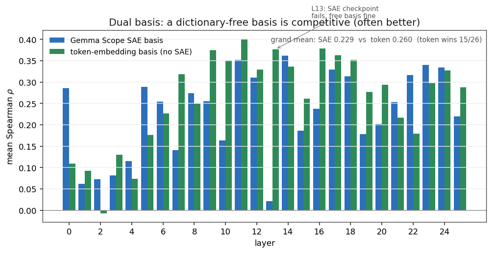

The [first post](../weight-space-map-of-attention-heads/) built a weight-space
map of Gemma-2-2B attention heads -- routing ($W_Q/W_K$), writing ($W_O/W_V$),
and feature programs -- in a fixed SAE coordinate system, and validated those
weight-space predictions against real attention on a handful of prompts. The
headline structure held up well in early and middle layers, then appeared to
*invert* in late layers: weight-space predictions went anti-correlated with
real attention past about L17. I called that the third of three depth regimes.

That regime was not real. While building follow-up experiments I found three
bugs in the pipeline, each small in code and large in consequence. After fixing
them and re-running the full 26-layer analysis, the late-layer inversion
disappears, every layer is solidly predictive, and two of the original post's
sharper claims need softening. The good news: the core method works *better*
than the first post reported, and two new diagnostics fell out of the cleanup.

These are lab notes on what broke, what the corrected map says, and what I now
believe about how load-bearing the SAE dictionary actually is.

::: {.callout-note appearance="simple"}
[**Code**](https://github.com/shubhamx64/residual-thoughts-blog/tree/main/code/weight-space-map) -- the fixes live in `weight_extraction.py`, `rope_utils.py`, and `activation_validation.py`, each now guarded by a parity test (`test_gamma_folding.py`, `test_rope_parity.py`). Corrected run: `analysis_20260610_233407.json`.
:::

::: {.callout-tip}
## TL;DR
- Three bugs -- **RMSNorm gamma folding** (missing the $+1$), **RoPE pairing convention** (interleaved vs rotate-half), and **validating against the wrong activations** -- corrupted the published numbers.
- **There is no late-layer anti-predictive regime.** It was an artifact. After the fixes, mean Spearman $\rho$ between predicted and real attention rises from **+0.011 (noise)** to **+0.229** across all 26 layers, every layer positive, with 100% sign stability. The old "Regime 3" is retracted.
- **The Layer-6 selectivity spike survives but is no longer unique** -- L8, L12, L14, and L22 sit in the same band. The identity/copy-routing peak actually lives at **L10**, not L6.
- **New:** the L13 oddity is a *Gemma Scope checkpoint* problem, not a model problem -- a dictionary-free basis predicts L13 fine while the SAE fails.
- **New:** a mean-centered **token-embedding basis with no SAE** validates *slightly better overall* (0.260 vs 0.229) and wins 15/26 layers. For routing, the SAE dictionary is not load-bearing.
- **The L23 causal result stands** (ablation still helps retrieval +6.2 pts) but its *explanation* changes: L23H0 is well-predicted now, so "the map can't see this head" is wrong.
:::

## The three bugs

All three are convention mismatches with Hugging Face's Gemma-2 implementation.
None changed the *shape* of the method; all changed the *numbers*.

### 1. RMSNorm gamma folding missed the $+1$

I fold the pre-attention RMSNorm gain into the projection weights so the SAE
basis lives in the right coordinate system. HF's `Gemma2RMSNorm` computes

$$y = \frac{x}{\operatorname{rms}(x)}\,(1 + \gamma),$$

but the pipeline folded $W \cdot \gamma$ instead of $W \cdot (1 + \gamma)$.
Gemma's learned $\gamma$ values are small, so this multiplied every folded
weight by roughly $\gamma$ instead of roughly $1$ -- a large, layer-dependent
distortion of every $B$ matrix and every selectivity number in the first post.
Per-layer cosine similarity between the legacy and corrected $B$ matrices ranges
from **0.71 at L0 to 0.97** deeper in the stack.

The fix is one term, but it touches everything, so it is now pinned by an
algebraic parity test (`test_gamma_folding.py`) that checks
$q_\text{proj}(\text{RMSNorm}(x)) = (x/\operatorname{rms}(x))\,W_\text{folded}^\top$
to relative error $< 10^{-4}$, and prints the legacy cosine per layer so the
bug magnitude is reproducible.

### 2. RoPE pairing convention

The weight-space routing analysis rotates queries and keys analytically rather
than sampling positions. I had assumed RoPE pairs *interleaved* dimensions
$(2i, 2i{+}1)$; HF Gemma-2 uses the **rotate-half** convention, pairing
$(i,\, i + d/2)$ with $d=256$. The two conventions agree on a scalar dot product
only by accident, so this quietly corrupted every RoPE stability curve and the
distance-binned validation.

Working the logit out from first principles,
$\text{logit}(t,s) = q^\top R(-\Delta)\, k$ with $\Delta = t - s$, so the *key*
must be rotated by $-\Delta$. The rewrite is checked against HF's own
`apply_rotary_pos_emb` (`test_rope_parity.py`, max diff $< 10^{-3}$), with the
old interleaved formula kept as a **negative control** that differs by one to two
orders of magnitude -- so the test cannot pass by tautology. Under the corrected
rotation, RoPE-stability AUCs rise everywhere (0.63--0.73 pre-fix to 0.65--0.89
fixed; peaks at L22 = 0.89, L14 = 0.88, L8 = 0.87).

### 3. Validation encoded the wrong activations

The first post's validation compared weight-space predictions against SAE
encodings of *post-layernorm* activations. But the Gemma Scope residual SAEs are
trained on the **raw residual stream**, not the normalized one, and the mismatch
between the two grows with depth -- which is exactly the shape of the spurious
late-layer inversion. The fix captures the raw block input via a
`forward_pre_hook`, encodes it with per-token $1/\operatorname{rms}$ scaling, and
keeps the $(1+\gamma)$ factor in the weights where it belongs. Key sampling is now
seeded per head so before/after comparisons are clean A/Bs rather than
re-rolls.

## Retraction: there is no anti-predictive regime

This is the big one. Here is the per-layer mean Spearman $\rho$ between
weight-space predicted attention and real attention (all 8 query heads, 20
prompts), pre-fix versus the corrected pipeline in two bases:

{#fig-prefix-vs-fixed}

| layer | pre-fix | fixed (SAE) | fixed (token) |
|---|---|---|---|
| 5 | 0.143 | 0.289 | 0.176 |
| 9 | **-0.156** | 0.255 | 0.375 |
| 10 | **-0.193** | 0.164 | 0.351 |
| 12 | **-0.184** | 0.311 | 0.329 |
| 13 | **-0.248** | 0.022 | 0.377 |
| 16 | **-0.113** | 0.238 | 0.379 |
| 24 | **-0.064** | 0.334 | 0.327 |
| 25 | 0.244 | 0.220 | 0.288 |

: Selected layers; bold marks the pre-fix values the first post read as "anti-predictive." The full 26-layer table is in the [errata note](#appendix-full-table). {#tbl-spearman}

The grand means tell the story: pre-fix **+0.011** (statistical noise), fixed
SAE basis **+0.229**, fixed token basis **+0.260**. Every layer the first post
labelled anti-predictive -- L9, L10, L12, L13, L16, L24 -- is solidly positive
after the fixes, with **100% sign stability** across heads. Best single heads
reach $\rho = 0.50$ overall (L11H3) and $\rho = 0.63$ on local distances (L6H0).

::: {.callout-important}
**Regime 3 is retracted.** The first post's "three depth regimes" framing had a
real early/transport regime and a real mid-stack routing band, but the third
"late-layer anti-predictive" regime was entirely an artifact of bug #3
interacting with depth. There is no regime where the weight map stops working.
:::

## The Layer-6 spike survives, its uniqueness does not

The first post made a lot of a Layer-6 selectivity spike that appeared to tower
roughly $105\times$ over a uniform baseline -- two orders of magnitude above
everything else. The spike is real, but the *contrast* was inflated by the gamma
bug. Corrected selectivity ($\text{Sel}\times\text{U}$, top-1 softmax mass over
uniform): L6 still peaks globally at **1451**, but **L8 (1176)**, **L22 (1113)**,
**L12 (866)**, and **L14 (912)** sit in the same band, all 3--25$\times$ above a
random-weights baseline. The corrected story is a *band of selective layers*
from L6 to L14 plus a late peak at L22 -- not a lone spike.

And the identity/copy-routing peak -- the diagonal mass of the routing matrix --
isn't even at L6. It's at **L10**:

{#fig-diag-mass}

## New: the L13 anomaly is an SAE checkpoint issue

L13 is the one layer where the corrected *SAE-basis* validation still fails
(mean $\rho = 0.022$). That looked alarming until I probed the same layer three
ways:

| probe | mean Spearman (8 heads) |
|---|---|
| layer-12 SAE (standard $-1$ offset, conceptually correct tap) | +0.022 |
| layer-13 SAE (offset 0, conceptually misaligned tap) | +0.176 |
| token-embedding basis (no SAE) | +0.377 |

: Three bases on L13 attention. The conceptually correct SAE is the worst; a dictionary-free basis is the best. {#tbl-l13}

The conceptually *correct* SAE is the *worst* of the three, and the dictionary-free
basis is the best. So attention at L13 is well-predicted by weight space -- the
`gemma-scope-2b-pt-res` layer-12 canonical 16k checkpoint is just a poor
dictionary for this purpose. The practical lesson: **basis disagreement is a
diagnostic.** When three reasonable bases disagree this sharply on one layer,
suspect the dictionary, not the model. Any SAE analysis leaning on that
particular checkpoint deserves a second look.

## New: a dictionary-free basis is competitive

That L13 result generalizes. I re-ran the whole validation using a *mean-centered
token-embedding matrix* as the probe basis -- no SAE at all -- and it validates
**slightly better overall** than the Gemma Scope SAEs:

{#fig-dual-basis}

Grand mean: **token 0.260 vs SAE 0.229**, with the token basis winning 15/26
layers. The SAE wins at L0, the L5--L6 selectivity band, and L21--L24. The
honest reading is uncomfortable for the original framing: **for routing analysis,
the SAE dictionary is not load-bearing.** A free, interpretable-enough basis does
as well or better through most of the stack. The SAE earns its keep where you
want *named* features for the OV/writing story, not for predicting *where*
attention goes.

## The L23 causal result, re-explained

The first post's one causal experiment -- ablating individual Layer-23 heads on
a factual-retrieval task -- still replicates: removing **L23H0 improves accuracy
by +6.2 points** (0.595 to 0.657, 800 prompts; L23H2 gives +3.2). That finding
stands.

What does not stand is the *explanation*. The first post tied the improvement to
the late-layer anti-predictive regime -- "the map flagged a high-leverage layer
but couldn't read its sign." Under the corrected map, L23H0 is **well-predicted**
(overall $\rho = 0.32$, local $0.57$), so the map *can* see it. The corrected
read of what L23H0 *is*: a **REPULSION** routing archetype (strong negative
affinities, min $\approx -37$) wearing a high copy-dominance OV circuit
(`copy_dominance` $= 0.95$). A head that copies content under repulsion-shaped
routing plausibly drags non-answer context into the final residual on cluttered
prompts -- consistent with ablation *helping* on a filler-heavy retrieval task.
Prediction quality and causal helpfulness are orthogonal; the first post
conflated them. Independent corroboration that L23 is special: instruction tuning
moves L23H0/H1 more than almost any other heads in the model (base vs `-it`
weight diff).

## What I'd take away

- **Pin your conventions with parity tests.** All three bugs were silent
  agreements-by-accident with HF that only a direct numeric cross-check exposes.
  The two parity tests now make these regressions loud.
- **A negative result on a basis is a result about the basis.** The L13 "failure"
  was the most informative single layer once I stopped assuming the SAE was ground
  truth.
- **Don't over-credit the dictionary.** For routing geometry, a dictionary-free
  basis matched or beat Gemma Scope across most of the stack. SAEs are still the
  right tool for *naming* what a head writes -- just not for deciding whether the
  weight map can predict attention at all.

::: {.callout-note appearance="simple"}
One pipeline-health caveat for circuit claims: 21.6% of feature programs in the
full-depth run used a fallback self-write injection, so the explicit-only program
histogram is the trustworthy one. Full corrected numbers, all 26 layers, and the
dual-basis breakdown are in `errata_full_depth.md` alongside the code.
:::

## Appendix: full table

The complete per-layer Spearman table (pre-fix, fixed SAE, fixed token) for all
26 layers, plus the corrected selectivity, RoPE-stability AUC, and dual-basis
per-layer winners, is in
[`errata_full_depth.md`](https://github.com/shubhamx64/residual-thoughts-blog/tree/main/code/weight-space-map)
with the accompanying run JSON. The figures above are generated from
`analysis_20260610_233407.json` and the 20-prompt validation outputs.
