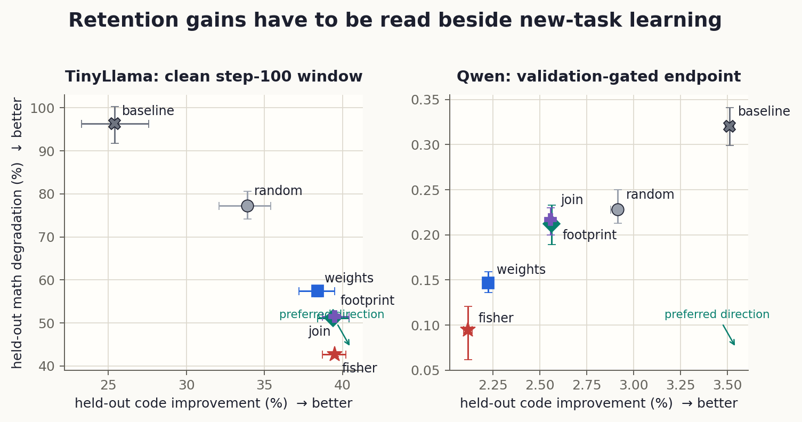
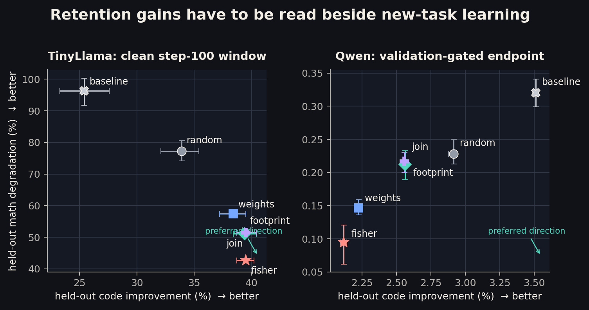
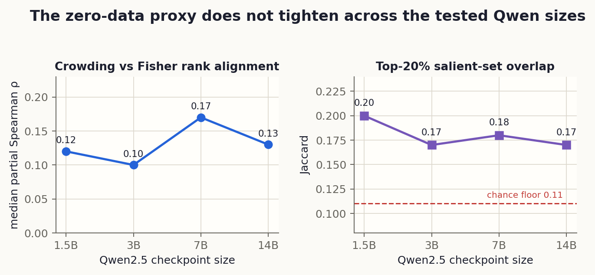
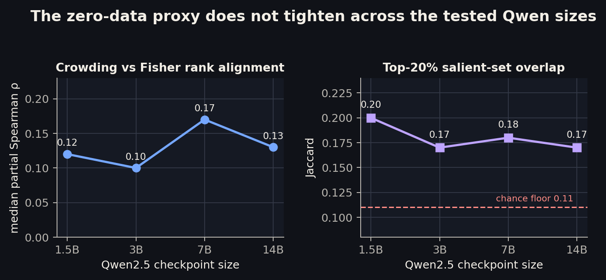

[paper 1]{.post-stamp .green} [five-seed interventions]{.post-stamp .green} [manuscript in preparation]{.post-stamp .pencil}

There is a tempting version of mechanistic interpretability in which the weights
tell you everything. Find the crowded directions, the high-gain blocks, the
near-duplicates; read the model's own capacity ledger without replay data,
gradients, or a forward pass. If that worked, a continually adapted model could
know what not to overwrite simply by inspecting itself.

Paper 1 asks how far that shortcut actually goes. I compared a **zero-data weight
geometry signal** with a **four-minute activation footprint** and, where the
experiment permits it, a **diagonal-Fisher reference**. The tests span four open
checkpoints—Qwen2.5-1.5B, Gemma-2-2B, Pythia-1.4B, and TinyLlama-1.1B—and four
operational questions: which neurons co-fire, which ones are risky to update,
which ones mix task regimes, and which ones deserve scarce precision.

The answer is useful precisely because it is not clean. Weight crowding carries
a real intervention signal. On TinyLlama, protecting the most crowded 20% of MLP
neurons is better than an equal-size random mask on both retention and new-task
learning, and recovers **72.5% of Fisher's retention benefit without task data**.
But the same ranking is not a universal importance map. Static features explain
only a minority of realized co-use, they do not rank coarse regime mixing, and a
healthy Qwen run turns the apparent protection win into a stability–plasticity
tradeoff.

This is the blog version of the Paper 1 manuscript while the arXiv submission is
being prepared. It emphasizes the operational picture rather than reproducing
the paper section by section.

::: {.callout-note appearance="simple"}
[**Code snapshot**](https://github.com/shubhamx64/residual-thoughts-blog/tree/main/code/live) — the footprint capture, weight-geometry, co-use, sequential-update, census, and quantization pipelines. The mirror now also carries [Paper 2's mechanism code](../why-crowding-protects/); this post is Paper 1 only.
:::

::: {.callout-tip}
## TL;DR
- A q99 **firing footprint** is cheap, stable within task regime (centered cosine about **0.99**), and decodes the five regimes at **98–100%** from one sequence. Its geometry is not reproduced by token unigrams alone.
- Highly overlapping write directions really do co-fire: crowded pairs activate at **1.6–3.5× independence**, versus **0.71–1.06×** for near-orthogonal pairs. But all static features together explain only **3.5–17%** of co-use rank variance.
- In TinyLlama's clean acquisition window, every informed 20% mask beats random on retention *and* code learning. Weight-only crowding recovers **72.5%** of Fisher; the cheap footprint recovers **84.4%**.
- In validation-gated Qwen, every mask learns code, but none beats random on both axes. More protection means less new-task learning: a frontier, not a continual-learning win.
- The weight-only proxy stays weak from Qwen2.5 **1.5B to 14B**; there is no evidence that scale closes the gap to Fisher.
- The negative boundary is firm: raw neuron crowding does **not** predict coarse task-regime mixing. [Post 3](../price-of-packing/) gives that pre-registered null and its positive controls in full.
- For quantization, activation magnitude is the better cheap signal below four bits; a short footprint capture can be competitive with gradient-guided allocation.
:::

## Two instruments and one expensive reference

The zero-data instrument is deliberately simple. For each MLP neuron, take its
write vector—the down-projection column, with RMSNorm gain folded in where needed—
and measure how close it sits to same-layer neighbours. E4 ranks neurons by their
largest absolute cosine. No examples, labels, activations, or gradients enter.

The usage instrument is also simple. On a short corpus spanning math answers,
math prose, code, code prose, and ordinary prose, record how often each neuron's
post-activation magnitude exceeds its layer's q99 threshold. Those five firing
rates form the neuron's **footprint**. The full capture is roughly 375,000 tokens
and takes about four minutes per model on the test machine.

Fisher is the data-rich reference: backward passes on the retained task estimate
which parameters its loss is locally sensitive to. It is not ground truth, but it
is the expensive rung that the cheap selectors are trying to approximate.

| rung | needs | what it knows |
|---|---|---|
| weight crowding | checkpoint only | local geometric overlap |
| firing footprint | one short forward capture | distribution-conditioned usage |
| diagonal Fisher | task data + backward passes | local loss sensitivity |

The paper's central mistake to avoid is collapsing these into one concept called
“importance.” They measure different things. The experiments ask when those
things happen to agree.

## First validate the cheap usage signal

Before using footprints to protect or quantize anything, I tried to break the
instrument. Split a regime in half and its centered footprint cosine stays near
**0.99** at every layer, essentially at the resampling noise floor. Compare
different regimes and the worst layer in each model still clears a three-sigma
separation criterion by **31–144×**. Shuffle the labels and the margin collapses
to zero.

A nearest-centroid classifier identifies the regime from a single sequence's
footprint at **98–100%**. That accuracy by itself is not impressive—token-unigram
classifiers also saturate on these datasets. The more useful test is placement.
Plain-English math questions and code descriptions sit closer to their
computational siblings in footprint space than unigram statistics predict, in all
four checkpoints. The net swing is **+0.16 to +0.75** for math prose and **+0.29
to +0.66** for code prose.

That does not make the footprint a pure readout of “computation.” It still knows
about dataset and register, and generation-time footprints move well beyond the
reading noise floor. Reading and generation need separate references. The claim
is narrower: a tiny forward capture produces stable, useful telemetry that raw
token counts do not reproduce.

## What the weights reveal—and what they miss

The weight map finds a striking worst case everywhere. Across checkpoints, the
99th percentile of pairwise write overlap is only **0.06–0.17**, while the single
largest coherence reaches **0.78–1.00**. Near-duplicate write directions exist at
every depth in every model, even when the bulk dictionary looks roomy.

Those overlaps are operational, not decorative. Roughly 500 pairs per layer were
stratified by write cosine and checked against real joint activity. Near-orthogonal
pairs fire at or below independence: median lift **0.71–1.06**. Crowded pairs fire
at **1.6–3.5× independence**, with the top decile reaching **7–59×**. Training has
not simply arranged overlapping neuron writes so that they take turns.

But geometry is not enough to reconstruct usage. Adding reader overlap and base
rates produces a full static model that explains only **3.5–17%** of co-use rank
variance. Gemma-2 is the most weight-legible case: its reader-set overlap reaches
Spearman $\rho=0.38$ and largely absorbs the incremental geometry term, yet the
full model still explains only 17%. On Qwen, Pythia, and TinyLlama, reader overlap
adds little.

One more family difference matters. About half the crowded pairs in gated MLPs
are anti-parallel opponents ($+v$ and $-v$), versus 18% in plain-GELU Pythia.
Simultaneous overlap is real; whether it is redundancy, cancellation, or harmful
interference cannot be read from absolute cosine alone.

## The causal test: freeze 20%, then learn something new

Correlation is cheap. The main intervention starts every arm from the same
after-math checkpoint, trains MLP weights on code, and freezes 20% of neurons per
layer according to one rule: none, random, weight crowding, math footprint,
crowding × footprint, or Fisher. The zero- and low-data masks are captured at the
base checkpoint and stay fixed. Only Fisher is computed after math.

Both outcomes are reported. **Less math degradation** means better retention;
**more held-out code improvement** means better acquisition. Calling a mask good
because it forgets less while it also learns less would hide the central tradeoff.

```{=html}
<figure class="theme-figure" aria-labelledby="tradeoff-caption">
  
  
  <figcaption id="tradeoff-caption">Five-seed means with 95% seed-bootstrap intervals. Lower-right is better. TinyLlama gives a Pareto improvement over random; validation-gated Qwen gives a stability–plasticity frontier. Each theme uses a separately rendered high-contrast asset.</figcaption>
</figure>
```

### TinyLlama: a clean Pareto improvement

At step 100, before repeated passes over the small code corpus begin to overfit,
every arm improves held-out code. Here all four informed selectors beat the
equal-budget random mask on both axes.

| arm | math degradation | code change | Fisher retention recovered |
|---|---:|---:|---:|
| Fisher | +42.7% | −39.5% | 100.0% |
| footprint | +51.1% | −39.4% | 84.4% |
| join | +51.5% | −39.5% | 83.6% |
| weights | +57.4% | −38.4% | 72.5% |
| random | +77.3% | −33.9% | 35.2% |
| baseline | +96.3% | −25.4% | 0.0% |

The weight-only mask reduces math degradation by **20.0 percentage points**
relative to random while improving code by another **4.5 points**. Across five
phase-B data-order seeds it recovers **72.5% [70.7, 74.3]** of Fisher's retention
benefit without task data. The forward-only footprint is stronger still at 84.4%
and nearly matches Fisher on code learning.

That is the clean positive result: raw geometry contains an intervention-relevant
signal, and cheap usage adds information.

### Qwen: protection becomes a frontier

The first Qwen schedule was too aggressive. Held-out code worsened from the first
evaluation in every arm, so its impressive-looking mask ranking is only a damage
stress test—not evidence of continual learning. I repaired the protocol before
observing protected-arm endpoints: a frozen train/validation split, a tenfold
lower learning rate, and validation-selected checkpoints within fixed budgets.
Both math acquisition and the phase-B code gate passed.

Under that healthy protocol, every arm learns code. None of the informed masks is
Pareto-superior to random. The weight-only mask reduces math degradation from
**0.228% to 0.147%**, but gives up **0.689 points** of code improvement. Fisher
retains best and learns least. The unprotected baseline learns most and forgets
most.

The honest reading is a stability–plasticity frontier. Fixed-step retention alone
cannot distinguish “protected old knowledge” from “the optimizer was prevented
from learning as much.” A matched-update or matched-acquisition design would be
needed to make the stronger claim.

## Scale does not rescue the shortcut

Perhaps geometry is merely noisy at 1–2B and becomes Fisher-like in larger models.
Across the tested Qwen2.5 series, it does not. The median rank agreement between
crowding and Fisher is **+0.12, +0.10, +0.17, +0.13** at 1.5B, 3B, 7B, and 14B.
The top-20% salient-set overlap stays at **0.17–0.20**, only modestly above the
0.11 chance floor.

```{=html}
<figure class="theme-figure" aria-labelledby="scale-caption">
  
  
  <figcaption id="scale-caption">Static alignment at the base checkpoint. The 7B point is the high point, not the start of a trend: 14B falls back. The intervention itself recovers less of Fisher at 3B and has too little arm separation to identify recovery at 7B.</figcaption>
</figure>
```

Under the fixed stress protocol, weight-only recovery falls from 90% at Qwen
1.5B to about 20% at 3B. At 7B the baseline and Fisher arms barely separate, so
the recovery ratio is not identifiable. This is not a scaling law—the effective
update and task competence are not matched across sizes—but it is clear evidence
against the hopeful claim that the proxy gap closes over the tested range.

## A firm negative boundary, and a useful secondary check

The strongest boundary deserves only a summary here because [Post 3](../price-of-packing/)
reports it in full. Neuron crowding does **not** provide a practically useful rank
of task-regime mixing on either MLP interface in any checkpoint. All eight primary
measurements sit inside the pre-registered $|\rho|<0.10$ null band. The same
pipeline recovers a planted law at **+0.52**, and its entropy proxy tracks known
mixing in a trained toy at **+0.83**. Weight geometry can predict an intervention
without yielding a semantic atlas.

Quantization supplies a different actuator and a useful consistency check. Keep
everything at four bits and give eight bits to the top 1% under each signal. Random
protection recovers nothing; usage and gradient signals recover **47–85%** of the
four-bit damage. Because quantization noise is not task-conditioned, the footprint
is promoted: it recovers about 85% of the gap on TinyLlama and can match or beat the
gradient-guided rung on these checkpoints.

With sequential GPTQ, the ranking is nearly saturated at four bits—every rung is
within 0.16 perplexity. Differences emerge at three bits and below, where activation
energy recovers **55%, 12%, and 19%** of three-bit damage at Qwen2.5 1.5B, 3B, and
7B. This is not a new quantizer. It is a practical hint: when the precision budget
is genuinely tight, a short activation capture carries information that static
weight geometry misses.

## The ledger after contact with data

The zero-data dream does not survive intact, but neither does it collapse.

1. **Weight geometry is a prior, not a verdict.** It locates crowded writes,
   predicts elevated co-use, and produces a causally useful protection mask in one
   clean checkpoint. It does not replace observed usage or loss sensitivity.
2. **A tiny footprint capture is an unusually good middle rung.** It is stable,
   distribution-conditioned, cheap enough to refresh, and often competitive with
   Fisher-like signals when the intervention depends on usage magnitude.
3. **Retention must be paired with acquisition.** The Qwen repair changes the
   story from “geometry protects” to “geometry moves the operating point.” That is
   still useful, but it is a different claim.
4. **Checkpoint heterogeneity is the rule.** Gemma-2 is unusually weight-legible;
   TinyLlama gives the clean Pareto result; Qwen gives a frontier. Architecture,
   scale, tokenizer, and training recipe are confounded here, so none of this is a
   family law.

The practical design I would carry forward is a two-signal ledger: use weights as
the always-available structural prior, then calibrate it with a small,
execution-mode-matched footprint. Escalate to gradients only when the decision is
important enough to pay for them.

Why crowding helps at all remains open. Paper 1 narrows the possibilities; it does
not settle the mechanism. That question belongs to Paper 2, and to
[a later post](../why-crowding-protects/).
