::: {.callout-note}
## Provenance
Originally published January 2, 2026. Migrated from Wix Studio and updated March 2026 with corrected figures and full 16K-feature validation results.
:::

This post uses model weights plus a fixed SAE feature basis to map what
kinds of routing and writing patterns are available inside Gemma-2
attention heads. The emphasis is on *available linear structure* in a
shared feature coordinate system, not on claiming that a head uses that
structure on typical tokens.

The payoff is a depth-wise map of head behavior without collecting new
activations or running generation for the main analysis. That map makes
it possible to ask a narrower question than "what does this head do?":
*what kinds of computations do the weights make available here, and
where do those capabilities concentrate with depth?*

This is a map-making update with explicit measurement objects,
validation, and clear failure modes -- not a claim that any specific
head is "the" cause of a behavior. Weight-space gives us leverage and
structure; sign and task relevance still require experiments, which is
why I treat the later causal section as a preview.

::: {.callout-note appearance="simple"}
[**Code**](https://github.com/shubhamx64/residual-thoughts-blog/tree/main/code/weight-space-map) -- snapshot of the analysis pipeline accompanying this post.
:::

::: {.callout-tip}
## TL;DR
- We map 200 attention heads (layers 1--25 of Gemma-2-2B) using weight-space analysis with SAE decoder directions -- no activations required.
- **Weight-space maps are reliable in early/mid layers** (local $\rho$ up to 0.82, 144/200 heads show local structure), **but become anti-predictive in late layers** (mean $\rho$ = -0.14 after L17). The overall mean $\rho$ = 0.07 averages out this sign flip.
- Layer 6 shows an extreme selectivity spike (105$\times$ uniform baseline) -- two orders of magnitude above other layers.
- Depth-dependent program shifts: early layers carry high SUPPRESS share alongside CROSS_COPY (filtering), mid layers mix CROSS_COPY/SUPPRESS/REINFORCE (composing), late layers lean CROSS_COPY (propagating).
- Long-range routing structure weakens but persists: 114/200 heads clear $|\rho| \geq 0.10$ at 128--256 tokens, 108/200 at 256+.
- OV negatives are late-layer outliers, not a layer-wide flip; strongest outlier is L20H7 at -0.64.
- **Causal preview**: ablating Layer 23 heads *improved* retrieval accuracy by +8.7% -- the map identified a high-leverage layer, but not the sign of its behavioral effect. Full results in Post 2.
:::

## Setup

We use the base model Gemma-2-2B (26 layers).

It uses Grouped Query Attention (GQA): 8 query heads and 4 KV heads, so
each KV head is shared by 2 query heads. This means each query head has
its own output projection ($W_O$) but reads from a shared value signal
($W_V$). We analyze query heads (not KV heads), since each has its own
routing and writing behavior.

One implication is worth keeping in mind later: sister query heads share
the same value source but can still look very different in the map. When
that happens, the specialization is unlikely to come from $W_V$ alone; it
has to be coming from routing ($W_Q/W_K$), the per-head output projection
($W_O$), or both.

1.  Gemma-2 scales attention logits by
    $\text{query\_pre\_attn\_scalar}^{-1/2}$. With `query_pre_attn_scalar` =
    256, we have $s = \sqrt{\frac{1}{256}} = \frac{1}{16} = 0.0625$.

2.  Softcap value: $c = 50.0$.

3.  Gemma-2 uses sliding window attention in alternating layers starting
    at index 0: even layers are sliding-window with size 4096, odd
    layers are global (full causal attention up to the model's max
    context length, 8192 tokens).

To talk about "features" rather than neurons, I use Google's Gemma Scope
Sparse Autoencoders (SAEs). SAEs decompose model activations into sparse,
interpretable directions. Each learned "feature" is a direction in
residual-stream space that tends to activate for a coherent pattern.
This gives us a model-aligned coordinate system for analyzing
attention: instead of asking "which neuron fires?", we can ask "which
interpretable feature does this head route or write?" These SAEs are
trained on base Gemma-2 models.

Analysis choice: I use the SAEs trained at the "Residual SAE" tap point.
Attention in block L consumes the residual stream produced by block L-1.
Thus, in my runs I use an SAE layer offset (-1) so the SAE basis matches
what the attention block actually sees. Each SAE feature has a decoder
direction (a vector in residual space). I'll treat those decoder
directions as a convenient, model-aligned basis for analysis. Please note
that SAE decoder directions are not orthogonal and activations are
nonnegative.

::: {.callout-note}
## Gemma Scope SAEs
For details on the available SAEs, see
[Google's Gemma Scope documentation](https://ai.google.dev/gemma/docs/gemma_scope).
:::

::: {.callout-warning}
## Key Approximation: RMSNorm Folding
Throughout, I fold the learned RMSNorm scale ($\gamma$) into weights but
ignore the token-dependent normalization factor ($1/\|x\|_{\text{RMS}}$).
This makes the analysis strictly linear-in-direction rather than
exact-in-activation. The approximation is tighter when the residual
stream has stable norms (early/mid layers) and more suspect in layers
with high statistical heterogeneity -- which may partly explain the
late-layer degradation discussed later.
:::

Using the base model avoids instruction-tuning artifacts and keeps the
focus on the raw attention mechanism.

## Weight-Space Object #1: Content-Only Routing in Feature Space

For a single attention head, I want a matrix that answers:

"If the query looks like feature i, which key-feature j does this head
prefer?"

Let:

- $D$ be the SAE decoder matrix for a subset of features (shape $n \times
  d_{\text{model}}$), one row per feature direction. (Convention: I treat decoder
  directions as row vectors; if you store decoders as columns, transpose
  accordingly.)

- $W_{Q}$, $W_{K}$ be the head's query/key projection matrices

Project decoder directions into Q-space and K-space:

$$Q_f = D \cdot W_Q^T$$

$$K_f = D \cdot W_K^T$$

Define the content-only affinity matrix (what attention logits would
look like if RoPE and masking weren't present):

$$B = (Q_f \cdot K_f^T) \cdot s$$

Where $s = \sqrt{\frac{1}{256}} = \frac{1}{16} = 0.0625$ (Gemma-2's
attention logit scaling).

Gemma-2 also applies a tanh soft-cap to attention logits; when matching
the model's behavior, I apply the same cap:

$$\text{softcap}(x) = c \cdot \tanh\left(\frac{x}{c}\right)$$

This $B$ matrix is the backbone of our routing analysis. From $B$ we
can define simple, interpretable routing metrics:

- **Selectivity** (peakiness): per row i, softmax over keys and take max
  probability; average over i -- "top-1 softmax mass"

- **Identity sensitivity**: how much softmax probability lands on the
  diagonal entry (i attends to i) -- "diagonal softmax mass"

- **Max-gap**: difference between best key score and runner-up (in logits),
  averaged over rows

- **Avoidance**: Negative entries in $B$ indicate low dot-product
  affinity. I treat extreme negative tails as a signature of selective
  exclusion, but it's not the same thing as suppression unless the
  $OV$ path also writes negative feature directions.

Important: rows/cols of $B$ are SAE features, not tokens. When I
compute "top-1 softmax mass", the softmax is over key features j, not
over token positions.

A few examples:

{#fig-routing-diagonal}

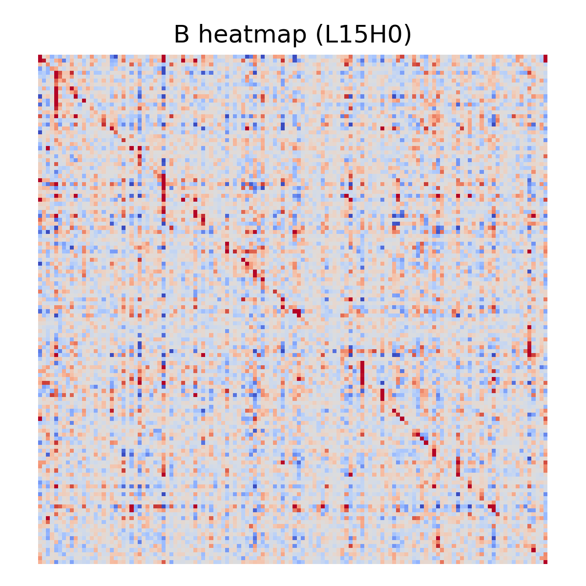{#fig-routing-selective}

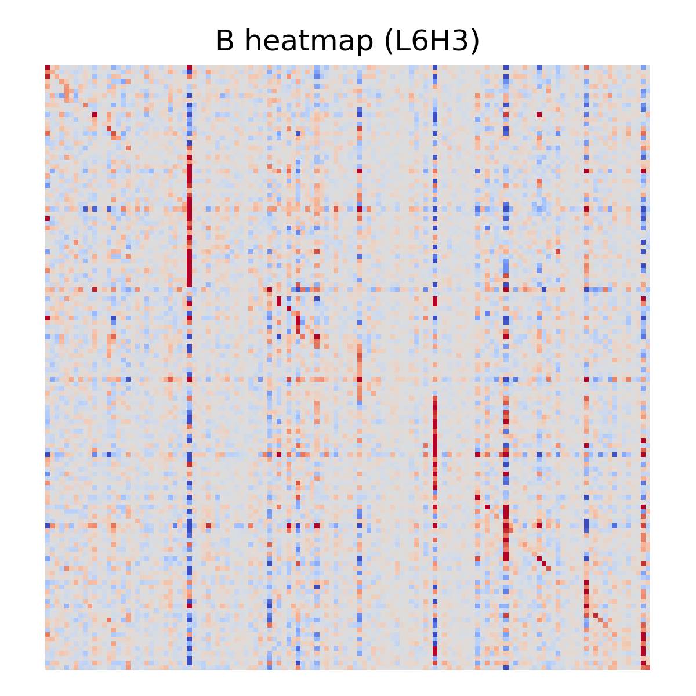{#fig-routing-avoidance}

### Sanity Check: Does B Predict Real Attention Routing?

Although the map in this post is computed purely from weights plus a
fixed SAE basis, I ran an activation-grounding sanity check to confirm
that the main routing object (the feature affinity matrix $B$) predicts
runtime attention patterns.

Across 200 heads (25 layers x 8 heads), using all 16,384 SAE features
and RoPE-aware affinity matrices $B_\Delta$, the activation-grounding run
covers about 4.45M token pairs per head. The headline result is mixed in
exactly the way that turned out to matter for interpretation: the map is
usefully predictive in early and mid layers, but degrades sharply in
late layers. The layerwise spread and threshold counts are shown in
@fig-validation-box and @fig-validation-thresholds.

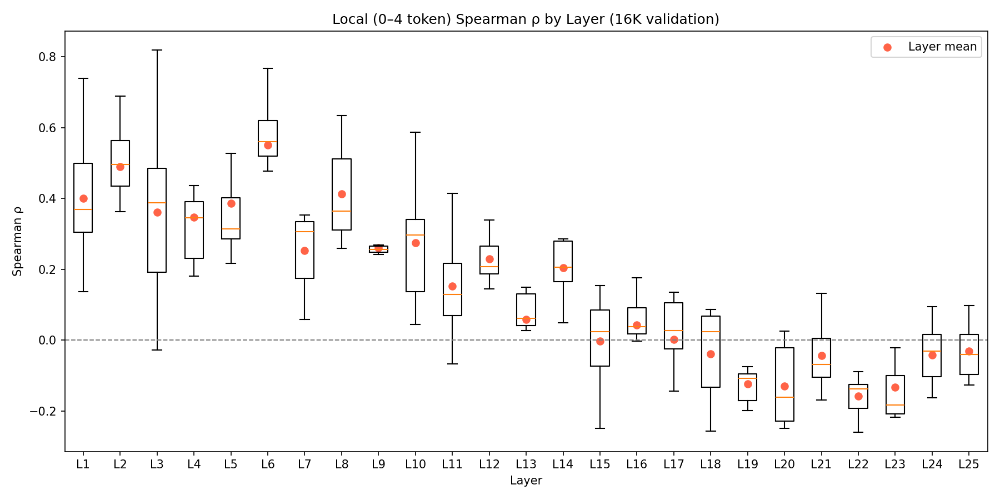{#fig-validation-box}

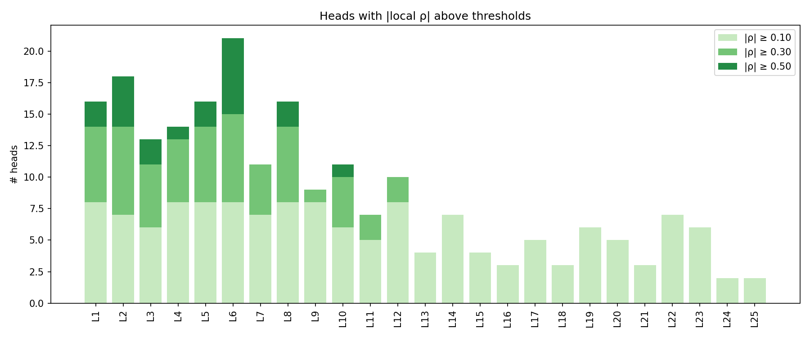{#fig-validation-thresholds}

For ~25 diverse prompts, I captured the pre-attention residual stream at
the target layer, encoded it into the same SAE feature subset used in
the weight-space map, and predicted attention preferences using the
bilinear form $a(t)^T B\, a(s)$. For the runtime target, I used log attention
weights. I compute correlations per query row and then average (to avoid
cross-row normalization artifacts), and I also break correlations out by
distance bins; log-softmax equals logits up to a per-row constant, so
rank correlation is meaningful even though each row has its own
normalization.

To account for RoPE, I also computed RoPE-aware affinity matrices $B_\Delta$ per
distance bin by rotating K ($\Delta$ set to the bin center) and applying
Gemma's tanh softcap, then compared predicted vs runtime attention
within each distance bin.

Summary statistics for the same run:

- ~4.5M token pairs per head
- Mean overall Spearman $\rho$ = 0.07 (std=0.21)
- Mean local (0--4 tokens) Spearman $\rho$ = 0.15 (max=0.82)
- 144 heads (72%) show $|\text{local } \rho| > 0.1$ ('structured' routing)
- Best local correlation: L5H4 with $\rho$ = 0.82
- Best overall correlation: L6H4 with $\rho$ = 0.57

The important caveat is that correlation is not uniform across depth. In
early layers (L1--L5), 35 of 40 heads show positive overall Spearman $\rho$
(mean +0.16), and mid layers (L6--L12) are even stronger (47/56 positive,
mean +0.22). But in late layers (L19--L25), 50 of 56 heads show negative
overall Spearman (mean -0.14), meaning the weight-space $B$ matrix
predicts the opposite of the observed attention pattern. This
degradation likely reflects nonlinear interactions or representational
drift that are not captured by the linear SAE decomposition. My best
guess is that the fixed residual-stream feature basis becomes a poorer
proxy for the computation actually being deployed near the top of the
network, where the model is closer to logits and late residual mixing is
more consequential. That is an interpretation, not a demonstrated
mechanism. The weight-space map remains a useful guide in early/mid
layers but should be treated as a capacity map rather than a behavior
map past roughly Layer 17.

The distribution is heavy-tailed: many heads are near-zero (diffuse),
while a smaller set shows strong, structured routing (e.g., best local $\rho$
= 0.82). The top 10 heads by overall Spearman (L6H4, L5H4, L3H2, L6H3,
L8H1, L8H0, L6H2, L8H6, L12H3, L12H2; all $\rho$ > 0.45) cluster in layers
3--12.

Please note that this doesn't prove any head is causally responsible for
a behavior; it just checks that the measurement objects used in the map
are anchored to runtime attention.

::: {.callout-important}
## Update (March 2026): Long-Distance Routing
Long-range structure is weaker than local routing, but it is not absent.
At 128--256 tokens, 114/200 heads still clear $|\rho| \geq 0.10$, and 108/200
do so at 256+; the more important failure mode is the late-layer sign
reversal in overall routing correlations rather than a complete
disappearance of long-range structure.
:::

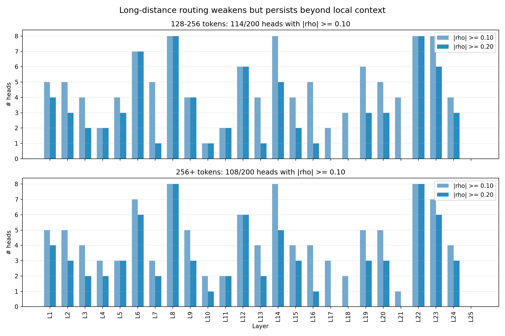{#fig-long-distance}

## Baselines: What Counts as "Real Structure"?

Softmax selectivity is extremely sensitive to logit scale, so we need
baselines that match the right thing. I use three baselines, each
designed to kill a different kind of structure:

1.  **Random decoder directions** (random D): Replace decoder directions
    with random unit vectors (matched norms), keeping $W_Q$/$W_K$ fixed

2.  **Random weights baseline**: Replace $W_Q$ and $W_K$ with random matrices
    (same shape), then rescale $B$ to match $\text{std}(B)$ before computing
    softmax-derived metrics. Specifically, we rescale $B_{\text{baseline}} \leftarrow
    B_{\text{baseline}} \times (\sigma_{\text{real}} / \sigma_{\text{baseline}})$, where $\sigma = \text{std}(B)$.

3.  **Permuted-K baseline**: Shuffle key-feature identities by permuting
    rows of $K_f$ (equivalently, permuting columns of $B$), so diagonal mass
    becomes 'chance self-match'.

This lets me say things like:

"Selectivity is X times the random-weights baseline."

"Diagonal mass is X times the permuted-K baseline."

Why both matter:

- top-1 mass is permutation-invariant (it only cares that you pick
  something)

- diagonal mass is identity-sensitive (it cares that you pick self)

## Weight-Space Object #2: What a Head Writes (OV) in Feature Space

Routing is only half the story. Even if a head can attend cleanly, it
only matters if its output projection writes a direction that's salient
in the SAE feature basis into the residual stream.

For a query head, its write is determined by:

- $W_V$ for the KV group (shared across 2 query heads in Gemma-2 GQA
  implementation)

- $W_O$ for the specific query head

Gemma's effective OV matrix is implemented as (row-vector convention;
$W_O$ is $[d_\text{model} \times d_\text{head}]$, $W_V$ is
$[d_\text{head} \times d_\text{model}]$):

$$W_{OV} = W_O \cdot W_V$$

For each SAE feature direction $d_j$ (row of $D$), define the write vector:

$$\text{write}_j = d_j \cdot W_V^T \cdot W_O^T$$

Project write vectors back onto decoder directions to get a
"write-to-feature" matrix:

$$\text{W2F}[j,k] = \cos(\text{write}_j,\, d_k)$$

Note: W2F uses cosine similarity, so it measures directional
alignment and discards magnitude; later I'll also report write norms /
activation-grounded deltas so 'aligned-but-tiny' writes don't get
over-interpreted.

This helps us define archetypes with concrete scoring.

With W2F as the cosine similarity matrix between each feature's write
vector and all decoder directions, we define:

- **COPY** score = mean(diag(W2F)): how much feature i writes back to itself

- **TRANSFORM** score = max off-diagonal of W2F: strength of the strongest i
  $\to$ j$\neq$i mapping

- **BROADCAST** score = max column sum of W2F: how many features write to
  the same target

- **SUPPRESS** score = |min off-diagonal of W2F|: strength of the most
  negative write

Copy dominance remains low on average (mean 0.186), but the more
informative pattern is the upper tail: the strongest copy head is the
early outlier L2H2 (0.897), while a secondary cluster of near-copy heads
appears in L23--L25. The distribution by layer is shown in @fig-copy-dominance.

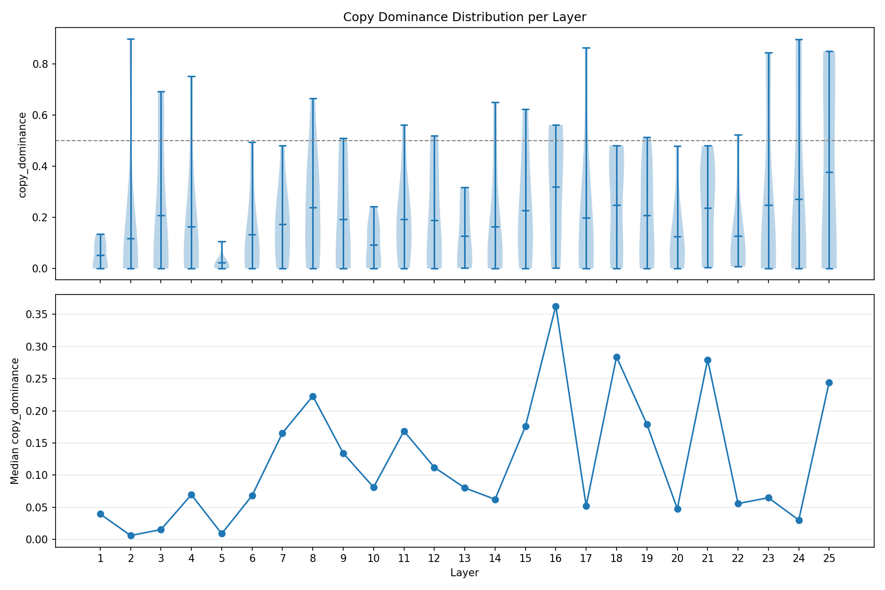{#fig-copy-dominance}

A head is classified by whichever score crosses its threshold first
(COPY > 0.3, TRANSFORM > 0.5, BROADCAST > 3x copy, SUPPRESS > 0.5),
defaulting to DIFFUSE (no score crosses any threshold). I assign a single label using a precedence rule
(COPY $\to$ TRANSFORM $\to$ BROADCAST $\to$ SUPPRESS $\to$ DIFFUSE). Heads can score
highly on multiple axes; the label is just meant to be a coarse summary.
These thresholds are heuristic cutoffs chosen to separate tails in this
run, not a claim that the taxonomy has canonical boundaries.

In this taxonomy, SUPPRESS means the head routes positively to some key
feature j, and then the OV write is negatively aligned with a target
feature k (it is not about negative B/avoidance). Also, please note that
COPY can be negative if the head writes anti-aligned to the feature's
decoder direction.

A few examples:

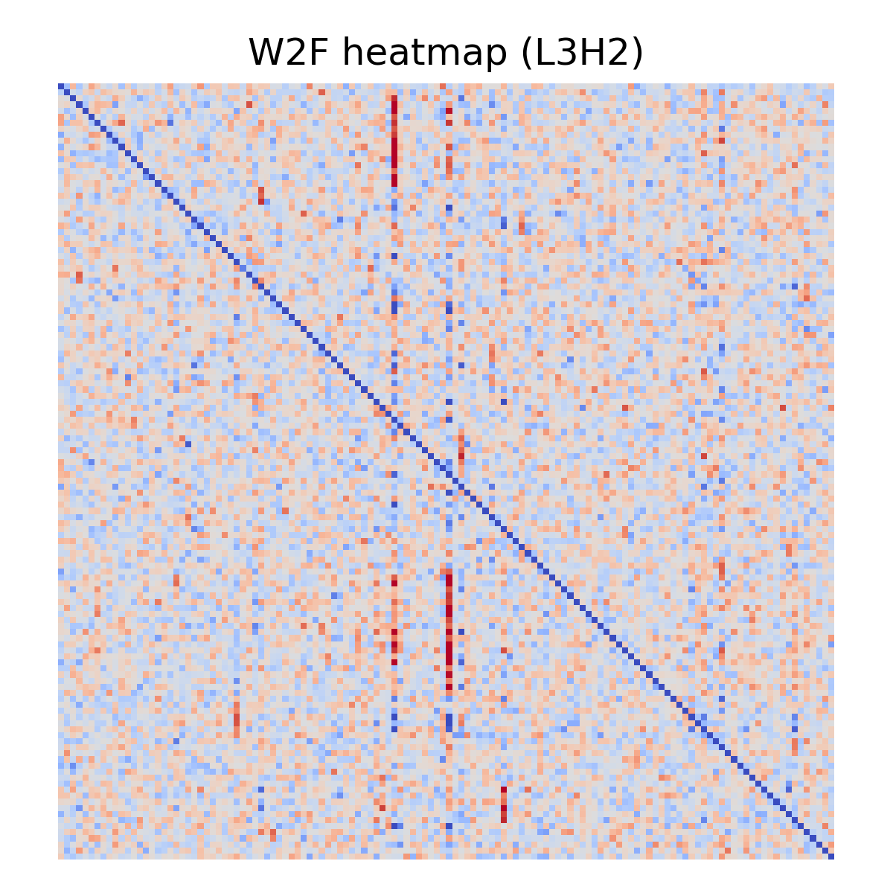{#fig-ov-transform}

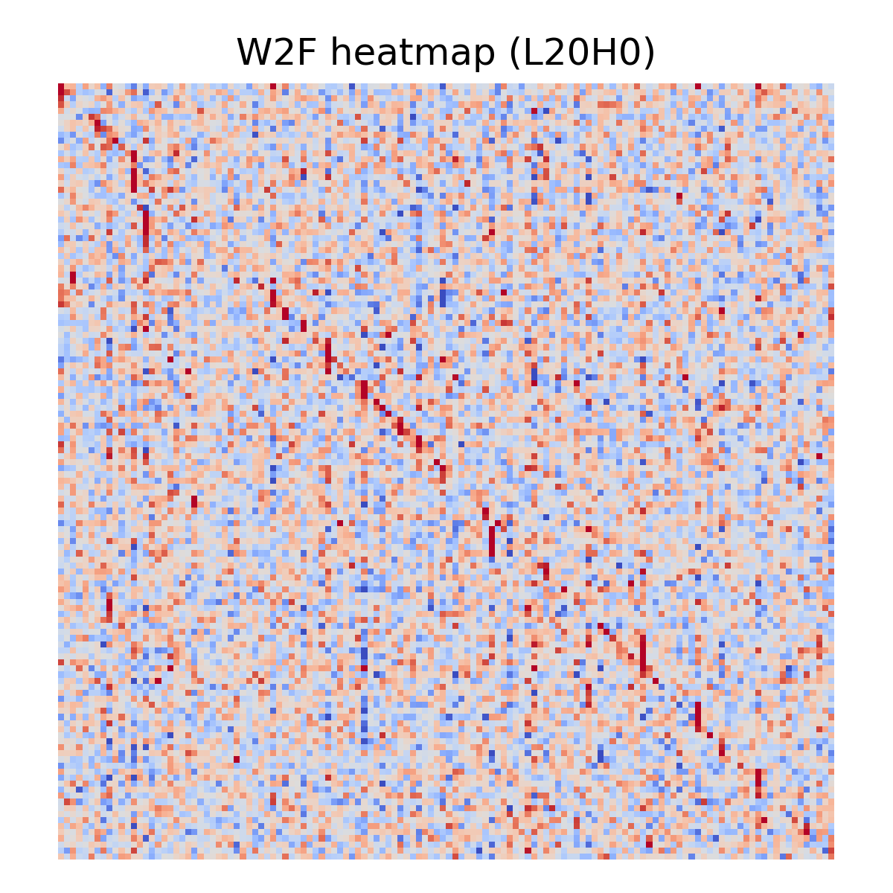{#fig-ov-broadcast}

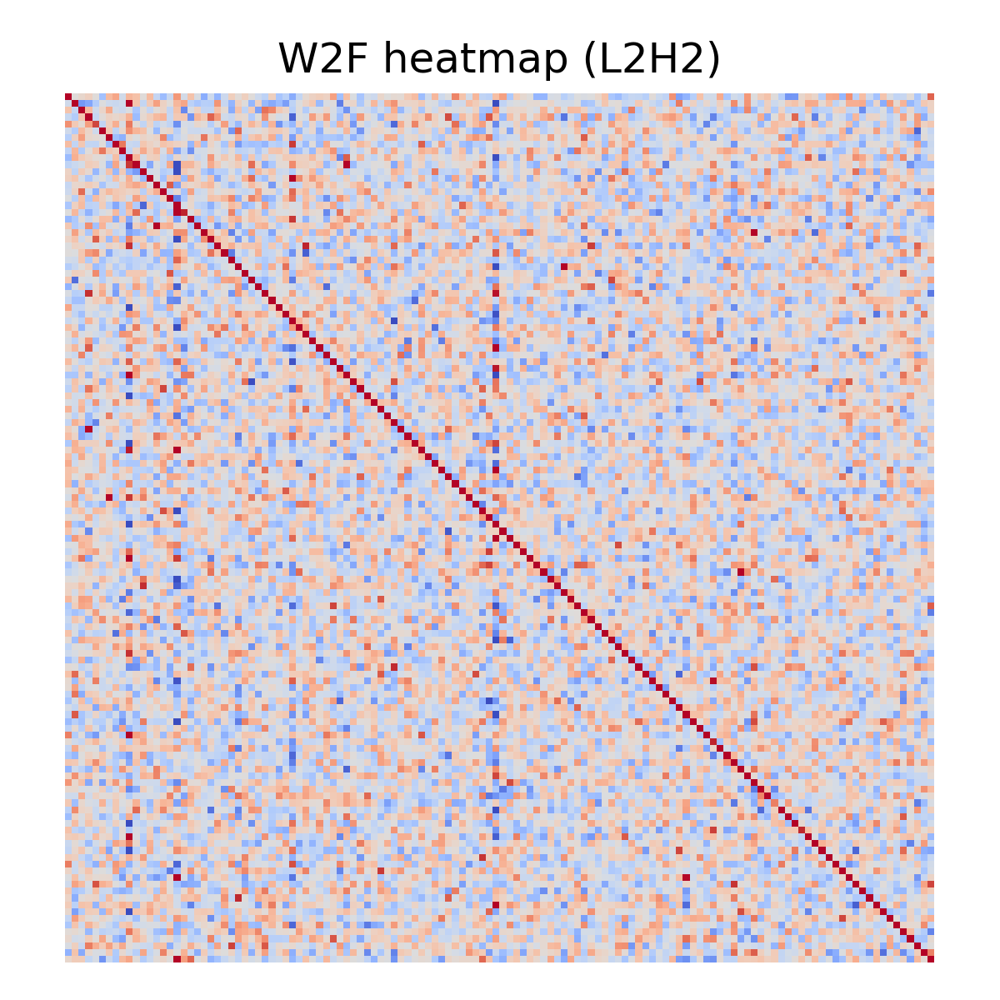{#fig-ov-copy}

::: {.callout-important}
## Update (March 2026): OV Sign-Flip Correction
OV validation shows a different failure mode from QK routing: late layers
develop negative outliers, but not a layer-wide median inversion. Most
late-layer medians stay positive, yet a subset of heads flips sign,
peaking at 25% negative heads in L21; the strongest outlier is L20H7 at
cosine = -0.64.
:::

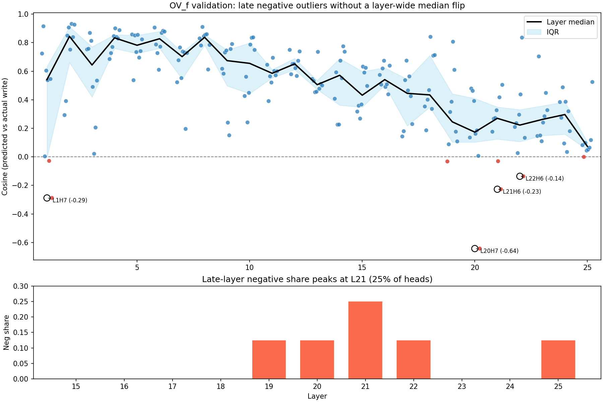{#fig-ov-signflip}

## Weight-Space Object #3: Composing "Feature Programs" (i $\to$ j $\to$ k)

Once we have routing ($B$) and writing (W2F), we can compose them into
simple "programs":

query feature i $\to$ attend key feature j $\to$ write feature k

Programs are extracted from the top tail of routing scores and write
scores (quantile thresholds), so the taxonomy describes high-confidence
motifs rather than all mass. We also track when a self-write is a
fallback rather than a measured OV target.

Each triplet is scored by combining route strength and write strength.
Then we can classify it into a small motif family:

| Type | Flow |
|------|------|
| REINFORCE | i $\to$ i $\to$ i |
| SHIFT | i $\to$ i $\to$ k (k $\neq$ i) |
| CROSS_COPY | i $\to$ j $\to$ j (i $\neq$ j) |
| RELAY | i $\to$ j $\to$ i (i $\neq$ j) |
| TRANSFORM | i $\to$ j $\to$ k (all different) |
| SUPPRESS | i $\to$ j $\to$ -k |

: Program types and their flow patterns {#tbl-programs}

This is the point where the analysis becomes human-legible: you can say
"this head implements a lot of CROSS_COPY" or "this layer is
SUPPRESS-heavy," without running a prompt.

In my run: routing tail $\approx$ top 10%; write tail $\approx$ top 20%.

::: {.callout-warning}
## Methodological Note: Fallback Writes
When a routing pair (i$\to$j) passes the route threshold but has no
explicit write evidence, the system can inject a synthetic self-write
using the head's copy_score as a fallback. This means some REINFORCE
programs may be artifacts of missing write evidence rather than genuine
self-reinforcing circuits. The explicit-only program histogram (without
fallbacks) is more conservative and should be preferred for circuit-level
claims.
:::

## Position Robustness: RoPE Stability

Gemma-2 uses RoPE, which rotates Q/K vectors as a function of relative
position. In weight space you can simulate this by rotating keys (or
queries) and recomputing affinity matrices.

Let $B_0$ be affinity at relative offset $\Delta=0$, and $B_\Delta$ at offset $\Delta$. Define a
stability score (e.g., cosine similarity of flattened matrices):

$$\text{stability}(\Delta) = \cos(\text{vec}(B_0),\, \text{vec}(B_\Delta))$$

Then compress the curve across $\Delta$ into a single number (AUC-style over
log-distance). I call this RoPE stability: a summary of how similar the
affinity matrix $B$ stays as we apply relative-position rotations. Also,
we apply the tanh softcap before comparing matrices.

- When this metric is **High** $\to$ routing seems to be mostly
  content-controlled and stays similar across positions. It could also
  mean that this head doesn't use positional information much because
  it's doing something else entirely.

- And when it is **Low** $\to$ routing depends strongly on relative position
  (more "twitchy").

This is not "style steerability," but it is a useful proxy for
"position-invariant content routing."

One caveat: cosine similarity can look high if $B$ is very low-magnitude /
diffuse; I interpret stability alongside routing strength/selectivity.

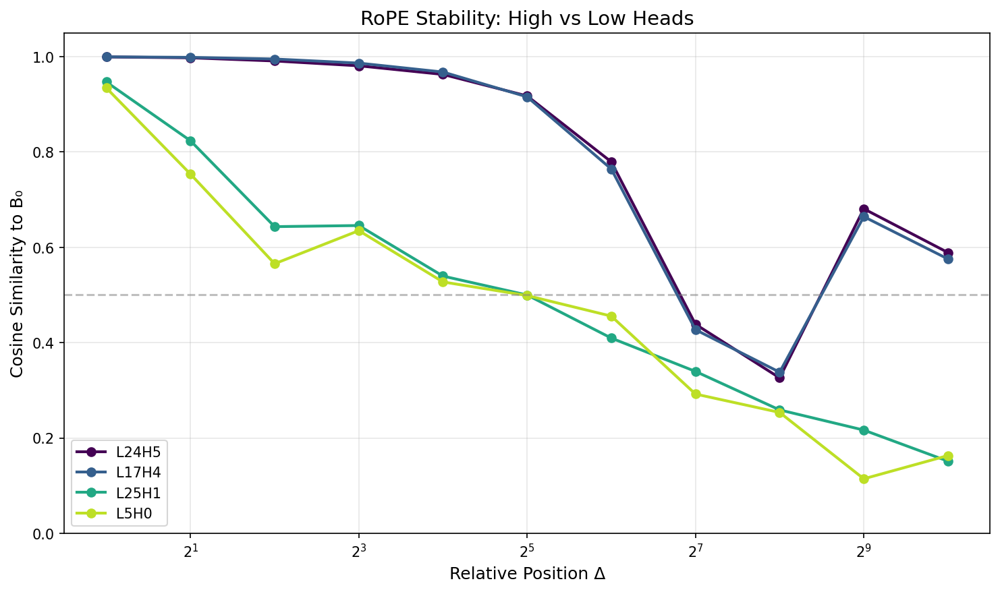{#fig-rope-curves}

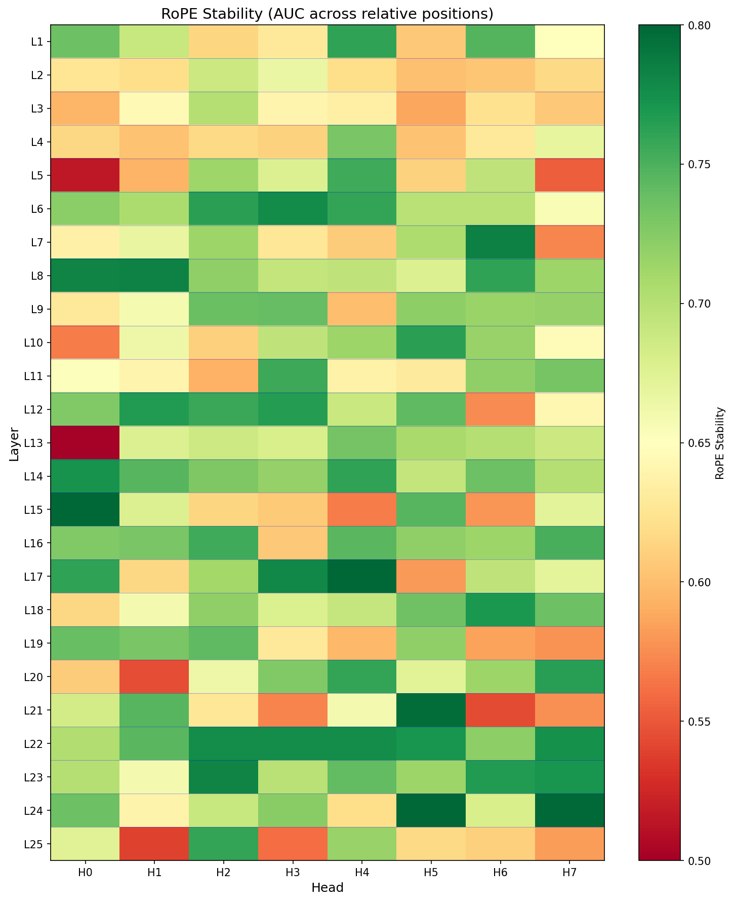{#fig-rope-heatmap}

## Results: What Changes with Depth?

Once we compute these objects across layers and heads, we can summarize
how the model's attention machinery evolves with depth.

### 1. Local (Sliding-Window) vs Global Layers

Gemma-2 alternates local and global attention by layer, giving a
built-in contrast:

Sliding-window layers can't directly attend to tokens outside the
window, but they can still transform a residual stream that already
contains long-range information injected by earlier global layers.

Global layers are the only layers that can implement direct long-range
attention pointers.

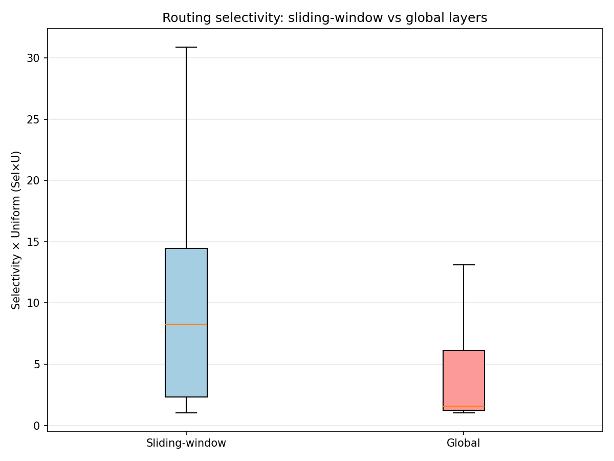{#fig-sel-by-type}

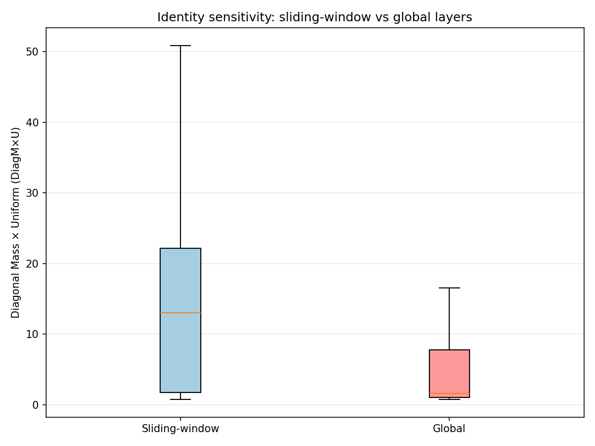{#fig-diagm-by-type}

### 2. Selectivity and Identity-Sensitivity Are Not Monotone

Two different things can happen as depth grows:

1.  Peakiness (top-1 softmax mass) can increase because the model learns
    sharper "addressing"

2.  Identity sensitivity (diagonal softmax mass) can increase if heads
    learn an i$\to$i "feature self-match" pattern

In my current run, there's a very strong spike in these metrics around a
mid layer (one layer stands out dramatically on both selectivity and
diagonal mass). That suggests a "band" of unusually crisp routing
behavior rather than a smooth trend.

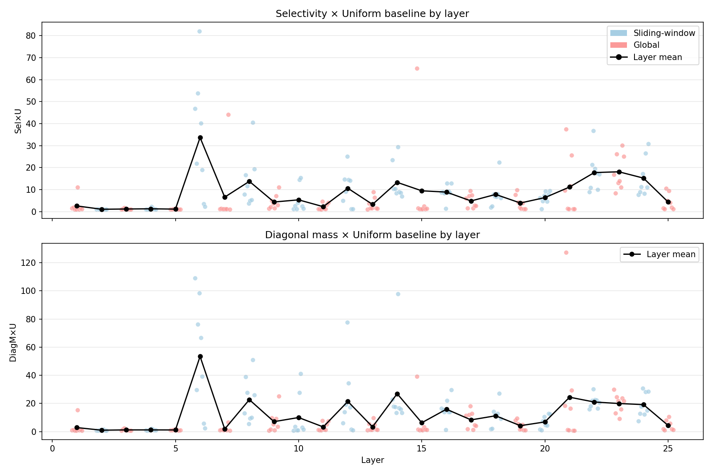{#fig-sel-diagm-depth}

::: {.callout-note}
## What Surprised Me
The Layer 6 spike was the single most dramatic finding -- Sel$\times$U of 105 means the routing structure is two orders of magnitude above uniform baseline. I expected a smooth gradient, not a spike. This showed up consistently across different feature subsets and seeds. Layer 6 is a sliding-window layer (even index) in the range where induction-like heads are typically found, and four of its heads (L6H0, L6H2, L6H3, L6H4) are among the top-10 validation-confirmed heads. The spike-rather-than-gradient pattern suggests a phase transition in routing behavior at this depth.
:::

### 3. RoPE Stability Tends to Rise with Depth (with Bands)

RoPE stability tends to increase with depth, but it's not smooth.
There are high-stability bands (mid layers and a late cluster
near the top of the network).

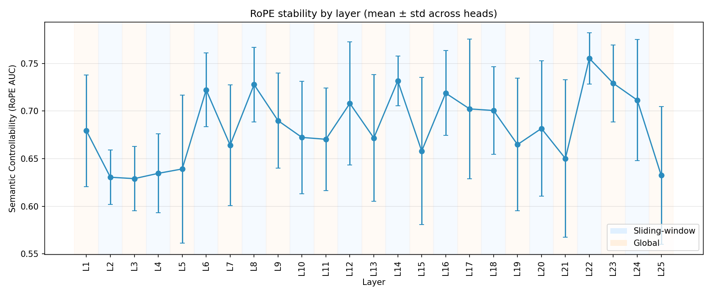{#fig-rope-depth}

### 4. Redundancy vs Uniqueness (Where Structure Concentrates)

I track how redundant heads are within a layer (do they "do the same
thing" in program space?). Redundancy = Jaccard similarity of top-20
routing pairs between heads -- that is, $|A \cap B| / |A \cup B|$ where
$A$ and $B$ are each head's set of top-20 (query $\to$ key) feature pairs.
Two heads are considered redundant if they route the same feature pairs
highly:

Low redundancy: a few specialized heads carry most structure -- could be
potential larger single-head "levers"

High redundancy: many heads share similar top programs -- could mean that
the layer is robust to removing any one head

To avoid noise, I primarily interpret redundancy within the subset of
heads that show structured routing (e.g., above a small selectivity or
correlation threshold).

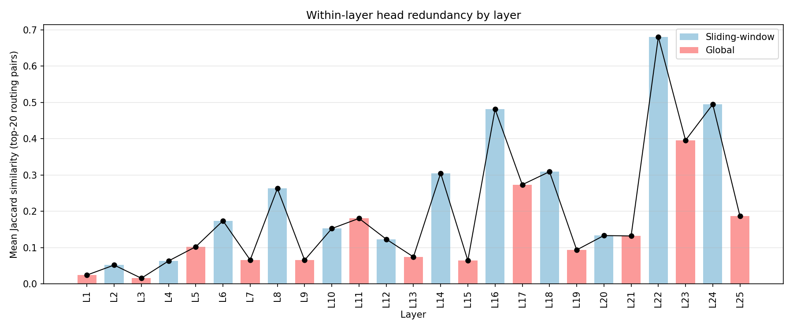{#fig-redundancy}

### Working Interpretation: Three Depth Regimes

Taken together, the plots suggest a cleaner story than any single metric
does on its own:

1. Early layers mostly look like *feature transport and filtering*.
   Routing is validated, selectivity is modest, and OV behavior is often
   suppressive or transform-light.

2. Mid layers, especially the Layer 6 band, look like a *routing
   bottleneck*. This is where the map is most predictive, selectivity
   spikes, identity-sensitive routing appears crisply, and several of the
   strongest validation-confirmed heads cluster.

3. Late layers still show strong structure in the map, but the QK side
   becomes anti-predictive at runtime. The natural reading is not "late
   layers are uninterpretable"; it is "late layers are where this fixed
   linear feature basis stops being a reliable behavioral proxy."

I think this is the most important qualitative insight in the post. The
headline is not just that certain layers spike, but that the *kind* of
structure the map is surfacing changes with depth.

The program distribution by layer (@fig-program-dist) makes this concrete: early layers carry substantial SUPPRESS (peaking in L2/L4–L6) alongside CROSS_COPY, mid layers mix CROSS_COPY / SUPPRESS / REINFORCE, and late layers tilt toward CROSS_COPY. The dominant program motif changes with depth even when the global histogram looks stable.

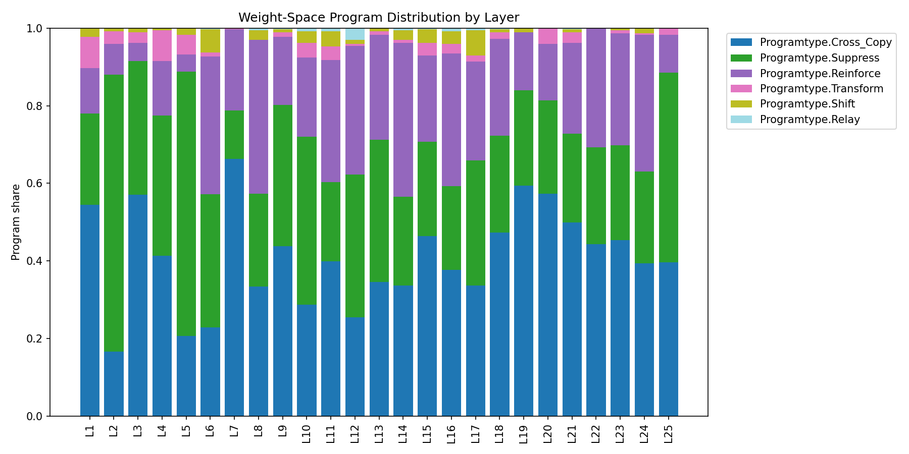{#fig-program-dist}

## Interpretation

Weight-space analysis is not telling you "what the model will output."
It's telling you what kinds of operations are available in the weights,
and where in depth those operations concentrate.

Safest takeaways from this weight-space + SAE-basis analysis:

- Local vs global layers are qualitatively different substrates. If a
  behavior requires long-range access, only global layers can implement
  it directly.

- There are depth bands with unusually crisp routing (spikes in
  selectivity and sometimes identity-sensitive diagonal mass).

- Redundancy varies a lot. Some layers look like "few special heads,"
  others spread structure across many heads.

- **Intervention heuristic**: Combining selectivity (0.3 weight),
  RoPE stability (0.4), head diversity (0.2), and max-gap
  (0.1) into a composite score, Layer 6 emerges as the strongest routing
  intervention candidate (score 0.51), followed by Layers 22--23. I now
  view this as a prioritization heuristic rather than a steering claim:
  the Layer 23 ablation result shows the map can identify leverage
  without predicting direction of effect.

## Predictions for Post 2 (Experiments Driven by Weight-Space)

In Post 2, I will test behavior, but driven by pre-registered
weight-space predictions.

One candidate hypothesis: heads with high selectivity and strong
directional write structure (high COPY/TRANSFORM/etc scores) but low
RoPE stability could contribute disproportionately to long-distance
errors on retrieval-style tasks; ablating their OV contribution may
measurably change accuracy (possibly improve or worsen), especially at
large distances.

::: {.callout-important}
## Update (Jan 2026): Causal Ablation Results
I ran causal ablation experiments on Layer 23 -- which the weight-space
map flagged as a high-selectivity, high-RoPE-stability late layer --
ablating individual heads and
multi-head combinations on retrieval-style prompts with symmetry controls
(swapped A$\leftrightarrow$B) and logits-only evaluation (no generation artifacts).

**The surprising result**: ablating 6 of 8 Layer 23 heads (H0, H1, H2,
H3, H6, H7) *improved* retrieval accuracy from 58% to 66.7% (+8.7%)
and widened the logprob margin from +0.34 to +0.59. H4 and H5 were
excluded because their individual ablation reduced accuracy. The
weight-space map correctly identified L23 as a high-leverage layer, but
the direction of effect was opposite to the naive prediction -- these
heads appear to *interfere with* correct retrieval rather than
facilitate it. Whether this reflects genuine suppressive behavior or a
limitation in the task design is an open question for Post 2.

I also ran a full OV writing validation across all 200 heads confirming
that predicted feature writes match actual head output with mean cosine
similarity of +0.50 in early/mid layers, but develop negative outliers
in late layers -- not a layer-wide median inversion. Most late-layer
medians stay positive, yet a subset of heads flips sign, peaking at 25%
negative heads in L21; the strongest outlier is L20H7 at cosine = -0.64
(see @fig-ov-signflip). This finding persists with the full 16K feature
set. Post 2 is in preparation.
:::

Implementation detail note: model constants like attention scaling, RoPE
placement, and alternating sliding-window convention are codified in the
project config.

This work is inspired by Anthropic's
[Transformer Circuits](https://transformer-circuits.pub/) series,
especially [A Mathematical Framework for Transformer Circuits](https://transformer-circuits.pub/2021/framework/index.html).

Code for the analysis pipeline is available in the
[code/weight-space-map](https://github.com/shubhamx64/residual-thoughts-blog/tree/main/code/weight-space-map)
directory of this site's repository (experimental research code snapshot).

Feedback, comments, and discussion are welcome.

## Limitations

**Linearity assumption.** We fold RMSNorm $\gamma$ into weights but
ignore the token-dependent $1/\|x\|_{\text{RMS}}$ factor, making the
analysis linear-in-direction rather than exact-in-activation. This
approximation is tighter when residual stream norms are stable
(early/mid layers) and degrades where norm variance is high (late
layers). This is likely one contributor to the late-layer anti-prediction
effect.

**SAE basis is not ground truth.** SAE decoder directions are
non-orthogonal and learned via reconstruction loss -- they may not
capture the model's "true" features. Feature splitting (one concept
spread across multiple SAE features) and superposition (multiple concepts
encoded in one direction) can distort the affinity matrix $B$. We do not
apply Gram-matrix correction for superposition in the main analysis,
though the infrastructure exists.

**Late-layer anti-prediction.** After ~Layer 17, the weight-space $B$
matrix predicts the opposite of observed attention (mean Spearman
$\rho$ = -0.14). This is not just noise -- it's systematic. All
late-layer metrics (selectivity, program distribution, write archetypes)
should be interpreted as "what the weights make available" rather than
"what happens at runtime." The sign flip likely reflects LayerNorm
interactions, residual stream composition, or accumulated superposition
that the linear analysis cannot capture.

**Feature-space selectivity $\neq$ token-space selectivity.** A head
can have diffuse routing over SAE features while being sharp over token
positions, or vice versa. Our selectivity metrics measure peakiness in
feature space -- this is a different (though correlated) quantity from
attention sharpness over positions.

**No direct causality.** Weight-space analysis maps available
operations, not actual behavior. A head scored as high-COPY might never
copy in practice because it never receives the right input distribution.
Causal validation (ablation, activation patching) is required to make
functional claims -- which is why Post 2 is in preparation.

**Single-seed sensitivity.** The main weight-space metrics use a
4,096-feature random subset. Absolute values (e.g., exact Sel$\times$U
numbers) shift across seeds. Qualitative patterns (which layers spike,
program distribution shape) are stable in spot checks but have not been
formally assessed for robustness.

## Appendix: Metric Glossary {#appendix-metric-glossary}

- **top1_mass** = mean over query features of max softmax probability across
  keys

- **Sel$\times$U** = top1_mass $\div$ (1/n)

- **diagonal_softmax_mass** = mean softmax mass on the diagonal entry
  (identity-sensitive)

- **DiagM$\times$U** = diagonal_softmax_mass $\div$ (1/n)

- **MaxGap** = average(top1_logit - top2_logit) per row

- **RoPE** (stability) = AUC summary of how stable $B$ remains under
  RoPE-relative rotations (called `semantic_controllability` in the code)

- **Copy** = mean diagonal of W2F (self-write strength)

- **Trans** (transform) = max off-diagonal of W2F (strongest i $\to$ j$\neq$i mapping)

- **COPY / TRANSFORM / BROADCAST / SUPPRESS / DIFFUSE** = write archetypes derived
  from W2F. DIFFUSE = no score crosses any threshold

- **Feature programs** = composed triplets i $\to$ j $\to$ k with a small taxonomy
