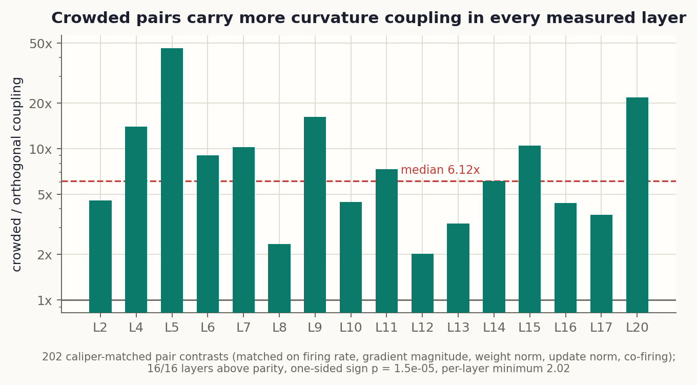
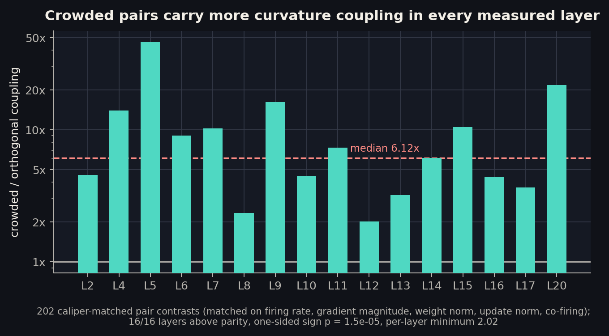
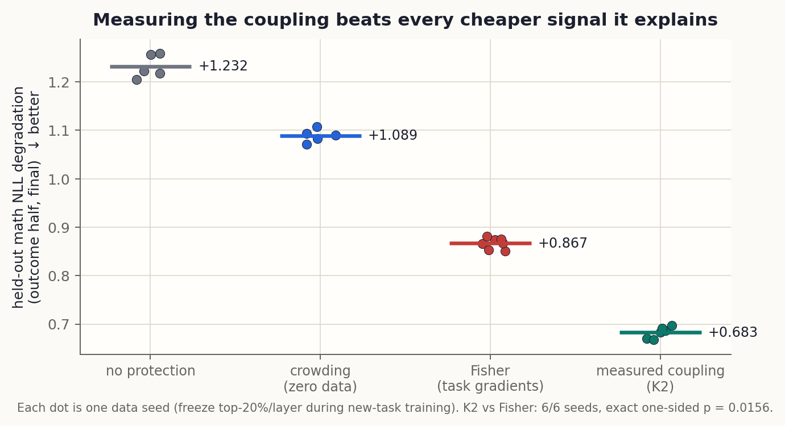
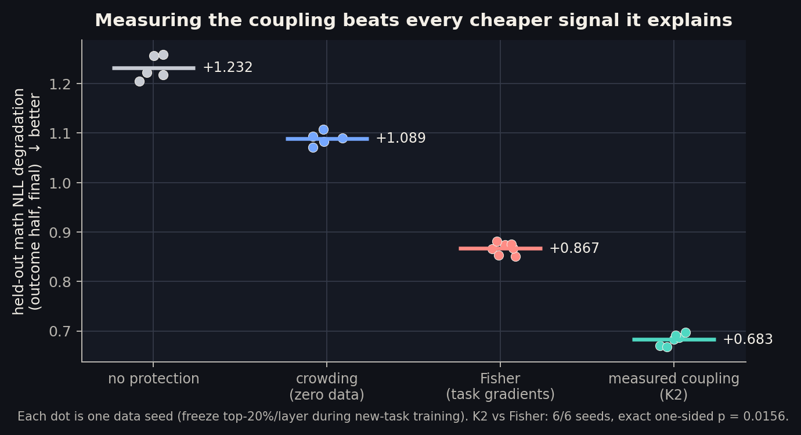
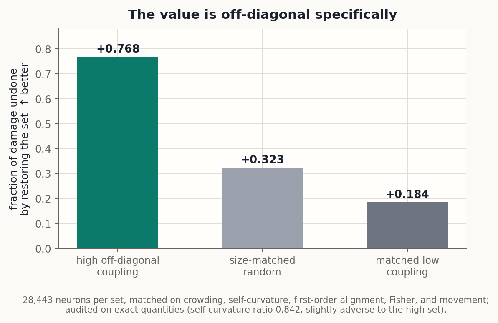
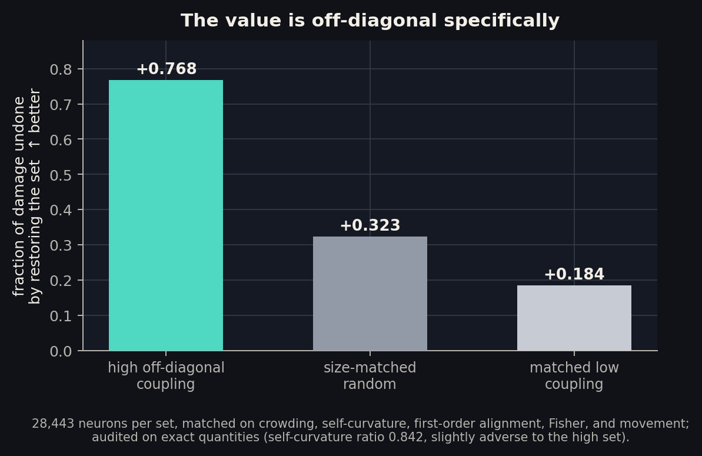

[paper 2]{.post-stamp .green} [preregistered]{.post-stamp .green} [manuscript in preparation]{.post-stamp .pencil}

Train a language model on something new and it quietly gets worse at things it
already knew. This is catastrophic forgetting, and one blunt but effective
defense is to freeze a fraction of the network while the new training runs.
The interesting question is which fraction.

In [an earlier study](../how-far-can-you-read-a-model-from-its-weights/) I
found something that kept bothering me. You can pick the neurons to freeze
using no data at all: just look at the weight file, find the neurons whose
output directions crowd together, and protect those. On the model where the
protocol is cleanest, that zero-data mask recovered most of the benefit of the
expensive, gradient-based alternative. A signal that has never seen a task, a
token, or a gradient somehow knows which neurons the next task will damage.

That should strike you as suspicious. Geometry does not know what the model
was trained on. Why would it know what is fragile?

This post is the answer, run as a detective story, because that is how the
investigation actually unfolded: four natural explanations, each eliminated by
a preregistered test, and then a mechanism that survives everything we could
throw at it. You do not need to have read the earlier posts; the next section
rebuilds the setup from scratch.

::: {.callout-note appearance="simple"}
**Code and provenance.** Every experiment here was preregistered before
running, with amendments dated and disclosed, on a frozen git history with a
SHA256 manifest of all result artifacts. The mechanism code ships with the
Paper 2 manuscript, which is in preparation; this post reports the findings.
:::

::: {.callout-tip}
## TL;DR
- Forgetting damage is a **second-order** phenomenon: at the end of training on
  a task, gradients are nearly flat, so damage arrives through the loss's
  *curvature*, and specifically through **cross-neuron (off-diagonal) curvature
  coupling**.
- Crowded neuron pairs carry **6.1x** the coupling of orthogonal pairs matched
  on rate, gradient size, weight norm, update size, and co-firing, in **16 of
  16** measured layers. After normalizing away self-curvature the contrast is
  still **5.1x**: the effect is genuinely between neurons, not within them.
- The coupling's anatomy matches the algebra that predicts it: **81%** flows
  through read-side changes emitted along *existing* aligned write vectors, and
  the only pathway gated by raw co-activation carries **3%**, which is why
  co-firing tests come up empty.
- Measuring the coupling directly (a quantity we call K2) yields the **best
  retention selector observed in the program**: better than crowding by a wide
  margin and better than Fisher on **6/6 seeds** (exact p = 0.0156).
- The value is off-diagonal *specifically*: with self-curvature, first-order
  alignment, Fisher, crowding, and movement all matched (and audited), high-
  coupling neurons undo **77%** of damage when restored; matched low-coupling
  neurons undo **18%**, less than random's 32%.
- The account predicts its own boundary: rescale the network in
  function-preserving ways and protection value swings wildly, because
  curvature lives in the optimizer's coordinates. Real fine-tuning holds the
  parameterization fixed, so the ledger applies there.
:::

## The setup, briefly

Everything happens in the MLP blocks of a small language model
(TinyLlama-1.1B). Each MLP neuron reads from the residual stream (the vector
that flows through the network, accumulating each layer's contributions),
decides how strongly to fire, and then writes its contribution back through
its **write vector**: one column of the down-projection matrix. The write
vector is the neuron's handwriting, the direction it adds to the stream.

**Crowding** is a property you can compute from the weight file alone: for
each neuron, take the largest absolute cosine similarity between its write
vector and any other write vector in the same layer. A crowded neuron shares
its output direction with a neighbor. An isolated neuron writes somewhere no
one else does.

The experiment that produced the mystery is a two-phase curriculum. Phase A
teaches the model math. Phase B trains it on code, and math quietly degrades.
Before phase B starts, we freeze the top 20% of neurons per layer according to
some signal, and afterwards we measure how much held-out math was lost (as
negative log-likelihood, NLL: lower degradation is better). The candidate
signals form a cost ladder:

| signal | needs | what it measures |
|---|---|---|
| crowding | the checkpoint only | write-direction overlap |
| footprint | one short forward capture | how often each neuron fires on math |
| Fisher | task data + backward passes | local loss sensitivity |

The [Paper 1 field report](../how-far-can-you-read-a-model-from-its-weights/)
established that every informed mask beats a random one here, and that
crowding, the bottom rung, recovers 72.5% of Fisher's retention benefit with
zero data. (There is also a firm negative: crowding does *not* predict which
neurons mix tasks semantically. That boundary got
[its own post](../price-of-packing/).) What Paper 1 could not say is *why* the
cheapest signal works. Time to interrogate suspects.

## Suspect 1: a tug-of-war between tasks

The most intuitive story: crowded neurons are where the two tasks fight. If
math and code both use a shared direction, their gradients should pull it in
conflicting ways, and protecting the battleground prevents the damage.

This is directly measurable: correlate each neuron's crowding with the
misalignment between task gradients (the cosine between its math gradient and
its code gradient, negated so that bigger means more conflict). Across three
models the correlation is **-0.001, -0.043, -0.020**. Nothing. Crowded neurons
are not gradient battlegrounds. The first-order tug-of-war does not exist at
the neuron level, let alone explain the protection.

## Suspect 2: crowding is secretly Fisher

Maybe geometry is just a blurry photocopy of loss sensitivity: crowded neurons
are important neurons, and we have merely rediscovered Fisher information at a
discount.

If so, the two signals should rank neurons similarly. They do not. Rank
alignment between crowding and Fisher sits between **0.1 and 0.36** depending
on the checkpoint, and the top-20% masks they select overlap barely above the
chance floor. Crowding protects *while disagreeing with Fisher about which
neurons matter*. Whatever it knows, it is not a cheap Fisher estimate.

## Suspect 3: standing in the optimizer's path

Perhaps crowded neurons are simply where phase B writes its update. Protection
would then be trivial: freeze the neurons the optimizer was about to bulldoze.

Correlationally, crowding barely tracks movement (about **-0.05** on
TinyLlama). But the causal test is better, and it is the most instructive
elimination in the program. After phase B finishes, take the damaged model and
surgically restore 20% of neurons to their pre-B values (a "rollback"),
choosing the neurons by different signals, and see how much math comes back.
Restoring the 20% that *moved most* brings back about **52%** of the lost
math; crowding brings back **67%**; Fisher **75%**; a random set, **27%**.
Movement is the *worst* informed selector. The damage does not live where B
wrote. It lives where the signals that know something about task A point, and
crowding is one of those signals.

## Suspect 4: fire together, forget together

The last natural story: crowded neurons co-activate. If two neurons fire on
the same tokens, an update that damages one context damages both, and their
joint usage is the transmission channel.

We measured co-firing directly (how often both neurons cross their layer's
99th-percentile activation threshold together, relative to independence) and
tested whether it carries or gates the damage-relevant quantity. It does not:
in a regression with geometry, co-firing and its interaction with geometry are
both null (interaction permutation p = 0.67), and within every geometry
stratum co-firing is inert. In case the threshold was the problem, we re-ran
the test with continuous co-activation statistics. Null again. Whatever links
crowded pairs, it is not that they fire at the same time.

## The turn: forgetting is a second-order crime

Here is the reframe that cracks the case. At the end of phase A, training has
converged: the gradient of the math loss is nearly flat. To first order,
*nothing* can hurt the model. The damage from phase B's update $\delta\theta$
arrives through the second-order term,

$$
\Delta L_A \;\approx\; \tfrac{1}{2}\, \delta\theta^\top H_A\, \delta\theta,
$$

where $H_A$ is the curvature (Hessian) of the math loss. Curvature is a matrix
over pairs of parameters, and that plural is the whole point. Its diagonal
blocks are **self-curvature**: how sensitive the loss is to moving one neuron
alone, which is roughly what Fisher tracks. Its off-diagonal blocks are
**coupling**: whether moving neuron $j$ changes the price of having moved
neuron $i$. If a pair couples positively, updating both together hurts more
than the sum of updating each alone. Forgetting, in this frame, is not a list
of individually fragile neurons. It has cross terms.

Work out what that coupling looks like for two MLP neurons (using the
Gauss-Newton form of the curvature, the positive-semidefinite part that comes
from the network's output geometry), and the dominant term factorizes:

$$
S_{ij} \;\sim\; \underbrace{(w_i \cdot w_j)}_{\text{geometry clock}}
\;\times\;
\underbrace{\textstyle\sum_t m_t\, c_i(x_t)\, c_j(x_t)}_{\text{usage clock}}
$$

The first factor is the overlap of the two neurons' *existing* write vectors,
which is exactly what crowding measures. The second is the co-response of
their activation *changes* under the update: not whether they fire together,
but whether the update moves their firing together, weighted by how much the
output cares. Two clocks, one geometric and one usage-driven, multiplied.

```{=html}
<figure aria-labelledby="hero-caption" style="margin:1.5rem 0">
<svg viewBox="0 0 680 320" role="img" xmlns="http://www.w3.org/2000/svg" style="max-width:680px;width:100%;height:auto;font-family:inherit">
  <defs>
    <marker id="arr" viewBox="0 0 10 10" refX="8" refY="5" markerWidth="7" markerHeight="7" orient="auto-start-reverse">
      <path d="M 0 0 L 10 5 L 0 10 z" style="fill:var(--write)"/>
    </marker>
    <marker id="arrp" viewBox="0 0 10 10" refX="8" refY="5" markerWidth="6" markerHeight="6" orient="auto-start-reverse">
      <path d="M 0 0 L 10 5 L 0 10 z" style="fill:var(--pencil)"/>
    </marker>
  </defs>
  <text x="110" y="26" text-anchor="middle" font-size="12.5" font-weight="600" style="fill:var(--ink)">what the weights show</text>
  <circle cx="45" cy="120" r="13" style="fill:var(--paper-raise);stroke:var(--write);stroke-width:2"/>
  <text x="45" y="124" text-anchor="middle" font-size="11" style="fill:var(--ink)">i</text>
  <circle cx="45" cy="200" r="13" style="fill:var(--paper-raise);stroke:var(--write);stroke-width:2"/>
  <text x="45" y="204" text-anchor="middle" font-size="11" style="fill:var(--ink)">j</text>
  <line x1="60" y1="116" x2="185" y2="146" style="stroke:var(--write);stroke-width:2.2" marker-end="url(#arr)"/>
  <line x1="60" y1="196" x2="185" y2="172" style="stroke:var(--write);stroke-width:2.2" marker-end="url(#arr)"/>
  <text x="140" y="122" font-size="11" style="fill:var(--write)">w<tspan baseline-shift="sub" font-size="8">i</tspan></text>
  <text x="140" y="202" font-size="11" style="fill:var(--write)">w<tspan baseline-shift="sub" font-size="8">j</tspan></text>
  <text x="110" y="248" text-anchor="middle" font-size="10.5" style="fill:var(--pencil)">crowded pair:</text>
  <text x="110" y="264" text-anchor="middle" font-size="10.5" style="fill:var(--pencil)">nearly aligned write vectors</text>

  <text x="345" y="26" text-anchor="middle" font-size="12.5" font-weight="600" style="fill:var(--ink)">two clocks, multiplied</text>
  <rect x="255" y="70" width="180" height="58" rx="8" style="fill:var(--paper-raise);stroke:var(--write);stroke-width:1.6"/>
  <text x="345" y="94" text-anchor="middle" font-size="11.5" font-weight="600" style="fill:var(--write)">geometry clock</text>
  <text x="345" y="112" text-anchor="middle" font-size="10.5" style="fill:var(--ink)">w<tspan baseline-shift="sub" font-size="8">i</tspan>&#8202;&#183;&#8202;w<tspan baseline-shift="sub" font-size="8">j</tspan> overlap of base writes</text>
  <text x="345" y="160" text-anchor="middle" font-size="17" style="fill:var(--ink)">&#215;</text>
  <rect x="255" y="182" width="180" height="58" rx="8" style="fill:var(--paper-raise);stroke:var(--read);stroke-width:1.6"/>
  <text x="345" y="206" text-anchor="middle" font-size="11.5" font-weight="600" style="fill:var(--read-deep)">usage clock</text>
  <text x="345" y="224" text-anchor="middle" font-size="10.5" style="fill:var(--ink)">co-response of the update</text>
  <line x1="445" y1="155" x2="490" y2="155" style="stroke:var(--pencil);stroke-width:1.8" marker-end="url(#arrp)"/>

  <text x="575" y="26" text-anchor="middle" font-size="12.5" font-weight="600" style="fill:var(--ink)">what forgetting feels</text>
  <rect x="510" y="90" width="65" height="65" style="fill:var(--paper-raise);stroke:var(--hairline)"/>
  <rect x="575" y="90" width="65" height="65" style="fill:var(--write);fill-opacity:0.28;stroke:var(--hairline)"/>
  <rect x="510" y="155" width="65" height="65" style="fill:var(--write);fill-opacity:0.28;stroke:var(--hairline)"/>
  <rect x="575" y="155" width="65" height="65" style="fill:var(--paper-raise);stroke:var(--hairline)"/>
  <text x="542" y="127" text-anchor="middle" font-size="11" style="fill:var(--pencil)">S<tspan baseline-shift="sub" font-size="8">ii</tspan></text>
  <text x="607" y="127" text-anchor="middle" font-size="12.5" font-weight="700" style="fill:var(--ink)">S<tspan baseline-shift="sub" font-size="9">ij</tspan></text>
  <text x="542" y="192" text-anchor="middle" font-size="12.5" font-weight="700" style="fill:var(--ink)">S<tspan baseline-shift="sub" font-size="9">ji</tspan></text>
  <text x="607" y="192" text-anchor="middle" font-size="11" style="fill:var(--pencil)">S<tspan baseline-shift="sub" font-size="8">jj</tspan></text>
  <text x="575" y="248" text-anchor="middle" font-size="10.5" style="fill:var(--pencil)">off-diagonal curvature:</text>
  <text x="575" y="264" text-anchor="middle" font-size="10.5" style="fill:var(--pencil)">joint damage beyond the sum</text>

  <text x="340" y="304" text-anchor="middle" font-size="10.5" style="fill:var(--pencil)">crowding is the zero-data shadow of the geometry clock</text>
</svg>
<figcaption id="hero-caption" class="figure-caption">The mechanism in one picture. Crowding reads the geometry factor of cross-neuron curvature straight from the weight file; forgetting pays the full product.</figcaption>
</figure>
```

If this account is right, crowding works because it is the zero-data shadow of
the geometry clock: it reads one factor of the off-diagonal curvature straight
from the checkpoint. And the account makes predictions sharp enough to
falsify. Crowded pairs should carry outsized coupling *at matched everything
else*. The coupling should flow through the existing write vectors, not
through co-activation. Measuring the coupling directly should beat every proxy
of it, including Fisher. And the advantage should survive matching on every
diagonal quantity. All four were registered before the tests ran.

## Exhibit A: crowded pairs carry the coupling

Measuring off-diagonal curvature naively is hopeless (the matrix is
billions-by-billions), so the estimator probes it: perturb one neuron's
parameters along its actual phase-B update direction, and read out how the
curvature responds at every other neuron in the layer. Three forward passes
and one backward pass per probe, validated against an exact reference
implementation on a small oracle model, plus a seven-gate sanity battery. We
ran 1,200 probes.

Then the matched contrast: take crowded pairs and orthogonal pairs that agree
on firing rate, gradient magnitude, weight norm, update norm, and co-firing
(202 matched contrasts), and compare their coupling.

```{=html}
<figure class="theme-figure" aria-labelledby="contrast-caption">
  
  
  <figcaption id="contrast-caption">Crowded pairs versus matched orthogonal pairs, per layer. Treating layers as the inference unit (pairs share neurons): 16/16 above parity, one-sided sign p = 1.5e-05.</figcaption>
</figure>
```

The median crowded pair carries **6.12x** the coupling of its matched
orthogonal counterpart, and every one of the 16 measured layers shows the
effect. The obvious deflationary reading, that crowded neurons just have more
curvature of every kind, fails: normalize each pair's coupling by its members'
self-curvature and the contrast is still **5.06x**. The excess is genuinely
*between* the neurons.

Two more registered checks. Crowding correlates with a neuron's total
within-layer coupling load at **+0.32**, passing the registered bar; the same
correlation against a *global* load that includes cross-layer terms drops to
+0.18, a registered miss we report as found. Crowding is a within-layer
statistic and sees within-layer load. And the coupling is **polarity-blind**:
pairs whose write vectors point in *opposite* directions couple exactly like
aligned ones (both predominantly positive, 69% and 71%). That refuted our own
registered sign prediction, and it vindicates the convention of measuring
crowding with absolute cosines: opponent neurons interfere like duplicates.

## Exhibit B: the anatomy matches the algebra

The two-clock factorization makes a structural claim: the coupling should be
carried by read-side activation changes emitted along the *existing* write
vectors (the $w_i \cdot w_j$ terms), not by update-write overlap gated by
co-activation. That is checkable, because each pair's coupling can be
decomposed into blocks by which interface sends and which receives.

On the 50 registered validation pairs, the read-by-read block flowing through
base write vectors carries a median **0.812** of each pair's coupling mass
(95% CI [0.737, 0.855]), and no single pair drives the result. The one block
that raw co-activation actually gates is the smallest of all nine, at
**0.031**. This is why Suspect 4 walked free: the tests were correct, and the
channel they tested barely exists.

Better, the decomposition contains its own discriminating prediction. The
base-write terms scale with $w_i \cdot w_j$, so read-side dominance should be
a property of *crowded* pairs specifically. It is: median share **0.872** for
crowded pairs, dissolving to **0.437** for orthogonal ones. The algebra
predicted a fingerprint and the data shows that fingerprint.

## Exhibit C: measure the coupling and it beats everything

If off-diagonal curvature is the mechanism, then the mechanism quantity should
be a better protection signal than any of its proxies. So we built one: **K2**,
each neuron's off-diagonal curvature row load along the actual update
directions, estimated with randomized sketches. K2 needs one sacrificial
unprotected run of phase B to know the update directions; it then selects the
top 20% per layer, and we re-run protection with that mask on fresh data
seeds. Evaluation is leakage-clean: K2 was built on one half of the held-out
math set, outcomes are scored on the other half, and the mask transfers across
update seeds.

```{=html}
<figure class="theme-figure" aria-labelledby="selector-caption">
  
  
  <figcaption id="selector-caption">Freeze top-20%/layer by each signal during phase B; final degradation on the leakage-clean outcome half. Horizontal bars are per-arm means.</figcaption>
</figure>
```

K2 beats crowding by **-0.40 NLL** and beats Fisher by **-0.183 on every one
of six seeds** (exact one-sided p = 0.0156). The registered "strong result"
band was merely matching Fisher; the data went past it. This is the strongest
retention selector observed anywhere in this program, and it overlaps the
crowding mask at only 0.32, so it is not crowding in disguise.

One fairness note, registered up front: K2 uses information Fisher does not
have (that one unprotected B-run). But Suspect 3 already showed that update
information *alone* is the worst selector in the program. Raw movement fails;
movement weighted by curvature wins. The curvature weighting, not the data
access, is what converts a B-run into the best mask.

## Exhibit D: the value is off-diagonal, specifically

The remaining skeptical reading: maybe K2-high neurons are just fragile in
every measurable way, and "off-diagonal" is along for the ride. Our first
attempt at this control was itself caught by an adversarial audit: the matched
sets turned out unbalanced on exact self-curvature and first-order alignment,
so we relabeled that result and registered a stricter design with a
stop-if-confounded gate.

Version 2 uses a near-exact diagonal estimator (agreement with exact
self-curvature: rho 0.993) and builds three sets of 28,443 neurons matched on
crowding, self-curvature, first-order alignment, Fisher, and movement, with a
post-construction audit on exact quantities. The audit passed with the balance
tilting slightly *against* the hypothesis (the high set's self-curvature is
0.84x the low set's). Then the causal test: restore each set to its pre-B
values inside the damaged model and measure how much math returns.

```{=html}
<figure class="theme-figure" aria-labelledby="isolation-caption">
  
  
  <figcaption id="isolation-caption">Restore each set to pre-damage values and measure the fraction of held-out math damage undone. Same crowding, same self-curvature, same first-order alignment, same Fisher, same movement; only the off-diagonal load differs.</figcaption>
</figure>
```

High-coupling neurons undo **+0.768** of the damage. Their
matched-on-everything-else low-coupling twins undo **+0.184**, *less than a
random set* (+0.323). With every diagonal explanation held fixed and audited,
the off-diagonal information alone separates recovery by +0.58. This is the
finding the whole case rests on, and it survived the audit that killed its
first version.

Two smaller pieces round out the picture. The neuron behaves as the natural
unit: freezing its three weight matrices contributes protection almost exactly
additively (shares 0.39 + 0.13 + 0.44, summing to 0.96), with no single
interface acting as the mechanism's home. And nothing here says forgetting is
*only* off-diagonal; self-curvature is real, which is why Fisher is a strong
selector. The claim is that the cross terms carry protection-relevant
information that no diagonal signal contains, and that crowding is a free
estimate of where those cross terms concentrate.

## The confession doubles as a prediction

A good mechanism should tell you where it stops working. This one does.

Curvature in the optimizer's coordinates is not a property of the abstract
function the network computes. You can rescale a SwiGLU neuron (multiply its
input row by a power of two, divide its output column by the same factor) and
the network's outputs do not change at all; with power-of-two factors the
logits are bitwise identical. But the curvature account says the *damage
process* should change, because the rescaling scales one damage pathway's
curvature by $\alpha^2$ and the other's by $\alpha^{-2}$.

So we ran the final registered experiment as a self-test: if protection value
is invariant under these function-preserving rescalings, the curvature account
is wrong. It is not invariant. Rescaling the protected neurons by 4 or by 1/4
raises protection value by **+163%** and **+99%**; a global random rescale
swings it by **-126%** (mostly by stalling learning: Adam's per-parameter
state is calibrated to the old scales). All three land far outside the
registered +-25% invariance band, in the direction the algebra points.

The scope condition, stated plainly: crowding's protection value is a joint
property of the computation's geometry *and* the optimizer's coordinates, not
of the function alone. Any deployment claim must hold the parameterization
fixed. Real fine-tuning does exactly that, so the ledger applies where it is
used; but nobody should carry these numbers across a reparameterization.

::: {.callout-important}
## Boundaries
The causal chain is established in one primary regime: TinyLlama-1.1B, one
math-to-code curriculum, 20% freezing budget, neuron granularity. The
curvature object is the Gauss-Newton form (concordance with the full Hessian
+0.67 on large entries; indefiniteness of the true Hessian documented).
Crowding tracks within-layer coupling load (+0.32) but not the global
cross-layer version (+0.18, a registered miss). The K2-versus-crowding paired
comparison sits at the n = 4 exact-test floor (p = 0.0625); K2-versus-Fisher
is the conventionally significant one (n = 6, p = 0.0156). On Qwen2.5-1.5B
under a healthy validated protocol, total forgetting is 0.003 NLL, so there
is nothing to dissect there; the aggressive-protocol Qwen results are scoped
to that regime. "Polarity has no effect" means no *detected* effect. All
amendments, gate stops, and the confounded first isolation control are
disclosed in the preregistration trail.
:::

## The ledger, upgraded

Where does this leave the practical picture from Paper 1?

The two-signal ledger (weights as a structural prior, a small activation
capture as calibration) turns out to have been approximating the two factors
of off-diagonal curvature all along: the geometry clock and the usage clock.
That reframe explains the program's stubborn observations in one stroke. Why
does zero-data crowding protect? It reads the geometry factor. Why does it
protect while disagreeing with Fisher? Fisher is diagonal; the information is
in the cross terms. Why did every co-firing test come up null? The
co-activation-gated pathway carries 3% of the coupling. And why is protection
value fragile under reparameterization? Because curvature is.

It also hands the next project its target. K2, the best selector we have ever
measured, costs a full sacrificial training run. The registered follow-up
question is a ladder: how close can you get to K2's value with zero lookahead
(a block-coherence ledger built from the weight file), or with 1, 4, or 16
early microbatches of the new task? The decomposition already tells us where
to look: read-side co-response against the write-vector Gram matrix, not raw
firing statistics. That allocator, a capacity ledger that knows what the next
task is about to break before it breaks it, is Paper 3.

The earlier post ended by admitting that why crowding helps at all remained
open. It is no longer open. Crowding helps because it is the visible half of
the quantity that forgetting actually uses: the off-diagonal curvature that
couples a neuron's fate to its neighbors'. The weights were never a complete
ledger. But on this question they were telling the truth, and now we know
which truth.
